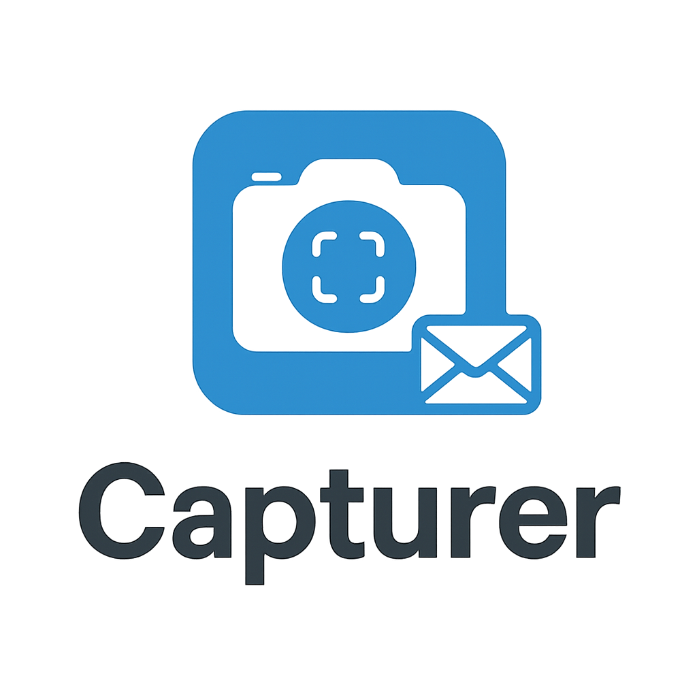

# 🔧 Capturer - Documentación Técnica para Desarrolladores



## 📋 Índice

1. [Arquitectura del Sistema](#arquitectura-del-sistema)
2. [Stack Tecnológico](#stack-tecnológico)
3. [Estructura del Proyecto](#estructura-del-proyecto)
4. [Servicios y Componentes](#servicios-y-componentes)
5. [Modelos de Datos](#modelos-de-datos)
6. [APIs y Integraciones](#apis-y-integraciones)
7. [Patrones de Diseño](#patrones-de-diseño)
8. [Configuración y Deployment](#configuración-y-deployment)
9. [Testing y Quality Assurance](#testing-y-quality-assurance)
10. [Métricas y Monitoreo](#métricas-y-monitoreo)
11. [Roadmap y Extensibilidad](#roadmap-y-extensibilidad)

---

## Arquitectura del Sistema

### Arquitectura de Alto Nivel

```
┌─────────────────────────────────────────────────────────────────────┐
│                     Capturer Application Architecture              │
├─────────────────────────────────────────────────────────────────────┤
│  Presentation Layer (Windows Forms)                                │
│  ├─ Form1.cs (Main Interface)                                      │
│  ├─ SettingsForm.cs (Configuration)                                │
│  ├─ EmailForm.cs (Email Management)                                │
│  └─ QuadrantEditorForm.cs (Advanced Features)                      │
├─────────────────────────────────────────────────────────────────────┤
│  Business Logic Layer (Services)                                   │
│  ├─ ScreenshotService.cs (Capture Engine)                          │
│  ├─ EmailService.cs (SMTP Integration)                             │
│  ├─ SchedulerService.cs (Task Scheduling)                          │
│  ├─ QuadrantService.cs (Advanced Processing)                       │
│  └─ ConfigurationManager.cs (Settings Management)                  │
├─────────────────────────────────────────────────────────────────────┤
│  Data Access Layer                                                 │
│  ├─ Models/ (Data Transfer Objects)                                │
│  ├─ Utils/ (Utility Classes)                                       │
│  └─ Configuration Files (JSON)                                     │
├─────────────────────────────────────────────────────────────────────┤
│  Infrastructure Layer                                              │
│  ├─ Windows GDI32 API (Screen Capture)                             │
│  ├─ Windows DPAPI (Encryption)                                     │
│  ├─ SMTP Protocol (Email)                                          │
│  └─ File System (Storage)                                          │
└─────────────────────────────────────────────────────────────────────┘
```

### Principios Arquitectónicos

- **Separation of Concerns**: Clara separación entre UI, lógica de negocio y acceso a datos
- **Single Responsibility**: Cada servicio tiene una responsabilidad específica
- **Dependency Injection**: Inversión de control para mejor testabilidad
- **Observer Pattern**: Comunicación desacoplada mediante eventos
- **Command Pattern**: Operaciones encapsuladas para mejor mantenimiento

---

## Stack Tecnológico

### Framework y Runtime

| Componente | Versión | Propósito |
|------------|---------|-----------|
| **.NET** | 8.0 | Framework principal |
| **C#** | 12.0 | Lenguaje de programación |
| **Windows Forms** | .NET 8 | Interfaz de usuario nativa |
| **Windows Desktop Runtime** | 8.0 | Runtime de ejecución |

### Dependencias NuGet

```xml
<PackageReference Include="MailKit" Version="4.8.0" />
<PackageReference Include="MimeKit" Version="4.8.0" />
<PackageReference Include="Newtonsoft.Json" Version="13.0.3" />
<PackageReference Include="NLog" Version="5.2.7" />
<PackageReference Include="System.Drawing.Common" Version="8.0.0" />
<PackageReference Include="Microsoft.Extensions.DependencyInjection" Version="8.0.0" />
<PackageReference Include="Microsoft.Extensions.Configuration" Version="8.0.0" />
<PackageReference Include="Microsoft.Extensions.Logging" Version="8.0.0" />
```

### APIs del Sistema Windows

| API | Librería | Función |
|-----|----------|---------|
| **GetDC** | user32.dll | Obtener contexto de dispositivo |
| **BitBlt** | gdi32.dll | Copia de bits de pantalla |
| **DPAPI** | crypt32.dll | Encriptación de datos sensibles |
| **Task Scheduler** | taskschd.dll | Programación de tareas |
| **Shell API** | shell32.dll | Integración con system tray |

---

## Estructura del Proyecto

### Organización de Archivos

```
Capturer/
├── Forms/                          # Interfaz de Usuario
│   ├── Form1.cs                    # Formulario principal
│   ├── Form1.Designer.cs           # Diseñador del formulario
│   ├── SettingsForm.cs             # Configuración
│   ├── EmailForm.cs                # Gestión de emails
│   └── QuadrantEditorForm.cs       # Editor avanzado
├── Services/                       # Lógica de Negocio
│   ├── IScreenshotService.cs       # Interface de captura
│   ├── ScreenshotService.cs        # Implementación de captura
│   ├── IEmailService.cs            # Interface de email
│   ├── EmailService.cs             # Implementación SMTP
│   ├── IQuadrantService.cs         # Interface cuadrantes
│   ├── QuadrantService.cs          # Procesamiento avanzado
│   └── QuadrantSchedulerService.cs # Programación avanzada
├── Models/                         # Modelos de Datos
│   ├── CapturerConfiguration.cs    # Configuración principal
│   ├── ScreenshotInfo.cs           # Metadata de capturas
│   ├── ProcessingTask.cs           # Tareas de procesamiento
│   ├── QuadrantConfiguration.cs    # Config de cuadrantes
│   ├── QuadrantRegion.cs           # Regiones de pantalla
│   └── ScheduledProcessing.cs      # Procesamiento programado
├── Utils/                          # Utilidades
│   ├── FileHelper.cs               # Operaciones de archivos
│   ├── SecurityHelper.cs           # Encriptación DPAPI
│   └── LoggingHelper.cs            # Configuración de logs
├── Program.cs                      # Punto de entrada
├── Capturer.csproj                 # Configuración del proyecto
├── app.manifest                    # Manifiesto de Windows
├── Capturer_Logo.ico              # Icono de la aplicación
├── Capturer_Logo.png              # Logo PNG
└── README.md                      # Documentación de usuario
```

### Configuración del Proyecto

```xml
<!-- Capturer.csproj -->
<Project Sdk="Microsoft.NET.Sdk">
  <PropertyGroup>
    <OutputType>WinExe</OutputType>
    <TargetFramework>net8.0-windows</TargetFramework>
    <UseWindowsForms>true</UseWindowsForms>
    <ImplicitUsings>enable</ImplicitUsings>
    <Nullable>enable</Nullable>
    <ApplicationIcon>Capturer_Logo.ico</ApplicationIcon>
    <ApplicationManifest>app.manifest</ApplicationManifest>
  </PropertyGroup>
  
  <ItemGroup>
    <EmbeddedResource Include="Capturer_Logo.png" />
    <EmbeddedResource Include="Capturer_Logo.ico" />
  </ItemGroup>
</Project>
```

---

## Servicios y Componentes

### ScreenshotService

**Responsabilidades**: Captura de pantalla usando APIs nativas de Windows

```csharp
public interface IScreenshotService
{
    Task<string> CaptureScreenshotAsync(string fileName = null);
    Task StartAutomaticCaptureAsync(TimeSpan interval);
    Task StopAutomaticCaptureAsync();
    bool IsCapturing { get; }
    event EventHandler<ScreenshotCapturedEventArgs> ScreenshotCaptured;
    event EventHandler<ScreenshotErrorEventArgs> CaptureError;
}

public class ScreenshotService : IScreenshotService
{
    private Timer _captureTimer;
    private readonly IConfiguration _configuration;
    private readonly ILogger<ScreenshotService> _logger;
    
    // Implementación usando GDI32 API
    [DllImport("gdi32.dll")]
    private static extern bool BitBlt(IntPtr hdcDest, int nXDest, int nYDest,
        int nWidth, int nHeight, IntPtr hdcSrc, int nXSrc, int nYSrc, uint dwRop);
    
    public async Task<string> CaptureScreenshotAsync(string fileName = null)
    {
        // Implementación de captura usando Windows GDI
        // 1. Obtener dimensiones de pantalla
        // 2. Crear bitmap compatible
        // 3. Copiar bits de pantalla
        // 4. Guardar como PNG
        // 5. Retornar ruta del archivo
    }
}
```

**Características técnicas**:
- **Multi-monitor support**: Captura automática de configuraciones extendidas
- **DPI awareness**: Adaptación a diferentes resoluciones
- **Memory efficiency**: Liberación inmediata de recursos
- **Error handling**: Manejo robusto de errores de captura

### EmailService

**Responsabilidades**: Envío de emails con adjuntos mediante SMTP

```csharp
public interface IEmailService
{
    Task<bool> SendEmailAsync(EmailRequest request);
    Task<bool> TestConnectionAsync();
    Task<bool> SendScreenshotsAsync(DateTime fromDate, DateTime toDate, 
        EmailFormat format = EmailFormat.Zip);
}

public class EmailService : IEmailService
{
    private readonly EmailConfiguration _config;
    private readonly ILogger<EmailService> _logger;
    
    public async Task<bool> SendEmailAsync(EmailRequest request)
    {
        using var client = new SmtpClient();
        
        try
        {
            // Conexión segura con TLS
            await client.ConnectAsync(_config.SmtpServer, _config.SmtpPort, 
                SecureSocketOptions.StartTlsWhenAvailable);
            
            // Autenticación con credenciales encriptadas
            var password = SecurityHelper.DecryptPassword(_config.PasswordEncrypted);
            await client.AuthenticateAsync(_config.Username, password);
            
            // Crear mensaje MIME con adjuntos
            var message = await CreateMimeMessageAsync(request);
            await client.SendAsync(message);
            
            await client.DisconnectAsync(true);
            return true;
        }
        catch (Exception ex)
        {
            _logger.LogError(ex, "Error sending email");
            return false;
        }
    }
}
```

**Optimizaciones**:
- **Connection pooling**: Reutilización de conexiones SMTP
- **Retry logic**: Reintento automático con backoff exponencial
- **Memory streams**: Evita bloqueos de archivos
- **Compression**: ZIP optimizado para reducir tamaño de adjuntos

### QuadrantService (Funcionalidad Avanzada)

**Responsabilidades**: Procesamiento avanzado de regiones de pantalla

```csharp
public interface IQuadrantService
{
    Task<ProcessingResult> ProcessQuadrantsAsync(QuadrantConfiguration config);
    Task<List<QuadrantRegion>> DetectRegionsAsync(Bitmap screenshot);
    Task ScheduleProcessingAsync(ScheduledProcessing schedule);
}

public class QuadrantService : IQuadrantService
{
    public async Task<ProcessingResult> ProcessQuadrantsAsync(QuadrantConfiguration config)
    {
        // Implementación de procesamiento por cuadrantes
        // 1. Dividir captura en regiones configurables
        // 2. Aplicar filtros y transformaciones
        // 3. Extraer información específica por región
        // 4. Generar reportes analíticos
    }
}
```

### SchedulerService

**Responsabilidades**: Programación y ejecución de tareas

```csharp
public class SchedulerService : IDisposable
{
    private readonly List<Timer> _timers = new();
    private readonly IServiceProvider _serviceProvider;
    
    public void ScheduleRecurring<T>(TimeSpan interval, Func<T, Task> action) 
        where T : class
    {
        var timer = new Timer(async _ =>
        {
            using var scope = _serviceProvider.CreateScope();
            var service = scope.ServiceProvider.GetRequiredService<T>();
            await action(service);
        }, null, TimeSpan.Zero, interval);
        
        _timers.Add(timer);
    }
}
```

---

## Modelos de Datos

### Configuración Principal

```csharp
public class CapturerConfiguration
{
    public ScreenshotSettings Screenshot { get; set; } = new();
    public EmailSettings Email { get; set; } = new();
    public StorageSettings Storage { get; set; } = new();
    public ScheduleSettings Schedule { get; set; } = new();
    public QuadrantSettings Quadrants { get; set; } = new();
}

public class ScreenshotSettings
{
    public TimeSpan CaptureInterval { get; set; } = TimeSpan.FromMinutes(30);
    public string OutputDirectory { get; set; } = GetDefaultDirectory();
    public bool AutoStartCapture { get; set; } = true;
    public ImageFormat Format { get; set; } = ImageFormat.Png;
    public int Quality { get; set; } = 90;
    public bool CaptureAllMonitors { get; set; } = true;
}

public class EmailSettings
{
    public string SmtpServer { get; set; } = "smtp.gmail.com";
    public int SmtpPort { get; set; } = 587;
    public string Username { get; set; } = string.Empty;
    public string PasswordEncrypted { get; set; } = string.Empty;
    public List<string> Recipients { get; set; } = new();
    public bool EnableAutomaticReports { get; set; } = true;
    public EmailFrequency ReportFrequency { get; set; } = EmailFrequency.Weekly;
    public TimeOnly ReportTime { get; set; } = new(9, 0);
    public EmailFormat AttachmentFormat { get; set; } = EmailFormat.Zip;
}

public class QuadrantConfiguration
{
    public List<QuadrantRegion> Regions { get; set; } = new();
    public ProcessingMode Mode { get; set; } = ProcessingMode.Standard;
    public Dictionary<string, object> Parameters { get; set; } = new();
}

public enum EmailFrequency
{
    Daily = 1,
    Weekly = 7,
    Monthly = 30,
    Custom = 0
}

public enum EmailFormat
{
    Individual,
    Zip
}

public enum ProcessingMode
{
    Standard,
    Advanced,
    Custom
}
```

### Metadata de Screenshots

```csharp
public class ScreenshotInfo
{
    public string FilePath { get; set; } = string.Empty;
    public DateTime CapturedAt { get; set; }
    public long FileSizeBytes { get; set; }
    public int Width { get; set; }
    public int Height { get; set; }
    public string ComputerName { get; set; } = Environment.MachineName;
    public string UserName { get; set; } = Environment.UserName;
    public Dictionary<string, object> Metadata { get; set; } = new();
}
```

---

## APIs y Integraciones

### Windows GDI32 Integration

```csharp
public static class NativeMethods
{
    [DllImport("user32.dll")]
    public static extern IntPtr GetDC(IntPtr hWnd);
    
    [DllImport("user32.dll")]
    public static extern int ReleaseDC(IntPtr hWnd, IntPtr hDC);
    
    [DllImport("gdi32.dll")]
    public static extern bool BitBlt(IntPtr hdcDest, int nXDest, int nYDest,
        int nWidth, int nHeight, IntPtr hdcSrc, int nXSrc, int nYSrc, uint dwRop);
    
    [DllImport("gdi32.dll")]
    public static extern IntPtr CreateCompatibleDC(IntPtr hdc);
    
    [DllImport("gdi32.dll")]
    public static extern IntPtr CreateCompatibleBitmap(IntPtr hdc, int nWidth, int nHeight);
    
    public const uint SRCCOPY = 0x00CC0020;
}

public class ScreenCaptureEngine
{
    public static Bitmap CaptureScreen()
    {
        var bounds = Screen.PrimaryScreen.Bounds;
        var bitmap = new Bitmap(bounds.Width, bounds.Height);
        
        using (var graphics = Graphics.FromImage(bitmap))
        {
            var hdcDest = graphics.GetHdc();
            var hdcSrc = NativeMethods.GetDC(IntPtr.Zero);
            
            NativeMethods.BitBlt(hdcDest, 0, 0, bounds.Width, bounds.Height,
                hdcSrc, 0, 0, NativeMethods.SRCCOPY);
            
            graphics.ReleaseHdc(hdcDest);
            NativeMethods.ReleaseDC(IntPtr.Zero, hdcSrc);
        }
        
        return bitmap;
    }
}
```

### DPAPI Security Integration

```csharp
public static class SecurityHelper
{
    public static string EncryptPassword(string plainPassword)
    {
        if (string.IsNullOrEmpty(plainPassword))
            return string.Empty;
        
        try
        {
            var data = Encoding.UTF8.GetBytes(plainPassword);
            var encrypted = ProtectedData.Protect(data, null, DataProtectionScope.CurrentUser);
            return Convert.ToBase64String(encrypted);
        }
        catch (Exception ex)
        {
            throw new SecurityException("Failed to encrypt password", ex);
        }
    }
    
    public static string DecryptPassword(string encryptedPassword)
    {
        if (string.IsNullOrEmpty(encryptedPassword))
            return string.Empty;
        
        try
        {
            var encrypted = Convert.FromBase64String(encryptedPassword);
            var data = ProtectedData.Unprotect(encrypted, null, DataProtectionScope.CurrentUser);
            return Encoding.UTF8.GetString(data);
        }
        catch (Exception ex)
        {
            throw new SecurityException("Failed to decrypt password", ex);
        }
    }
}
```

### SMTP Configuration

```csharp
public class SmtpConfiguration
{
    public static readonly Dictionary<string, SmtpSettings> PresetConfigurations = new()
    {
        ["Gmail"] = new SmtpSettings
        {
            Server = "smtp.gmail.com",
            Port = 587,
            SecurityOptions = SecureSocketOptions.StartTlsWhenAvailable,
            AuthenticationRequired = true
        },
        ["Outlook"] = new SmtpSettings
        {
            Server = "smtp-mail.outlook.com",
            Port = 587,
            SecurityOptions = SecureSocketOptions.StartTlsWhenAvailable,
            AuthenticationRequired = true
        },
        ["Office365"] = new SmtpSettings
        {
            Server = "smtp.office365.com",
            Port = 587,
            SecurityOptions = SecureSocketOptions.StartTlsWhenAvailable,
            AuthenticationRequired = true
        }
    };
}
```

---

## Patrones de Diseño

### Dependency Injection Pattern

```csharp
public class Program
{
    public static void Main(string[] args)
    {
        var services = new ServiceCollection();
        ConfigureServices(services);
        
        var serviceProvider = services.BuildServiceProvider();
        
        Application.SetHighDpiMode(HighDpiMode.SystemAware);
        Application.EnableVisualStyles();
        Application.SetCompatibleTextRenderingDefault(false);
        
        var mainForm = serviceProvider.GetRequiredService<Form1>();
        Application.Run(mainForm);
    }
    
    private static void ConfigureServices(ServiceCollection services)
    {
        // Configuration
        services.AddSingleton<IConfiguration>(provider =>
        {
            var builder = new ConfigurationBuilder()
                .SetBasePath(AppDomain.CurrentDomain.BaseDirectory)
                .AddJsonFile("appsettings.json", optional: true)
                .AddEnvironmentVariables();
            return builder.Build();
        });
        
        // Services
        services.AddSingleton<IScreenshotService, ScreenshotService>();
        services.AddSingleton<IEmailService, EmailService>();
        services.AddSingleton<IQuadrantService, QuadrantService>();
        services.AddSingleton<SchedulerService>();
        
        // Forms
        services.AddTransient<Form1>();
        services.AddTransient<SettingsForm>();
        services.AddTransient<EmailForm>();
        
        // Logging
        services.AddLogging(builder =>
        {
            builder.AddNLog("nlog.config");
        });
    }
}
```

### Observer Pattern for Events

```csharp
public class ScreenshotService : IScreenshotService
{
    public event EventHandler<ScreenshotCapturedEventArgs>? ScreenshotCaptured;
    public event EventHandler<ScreenshotErrorEventArgs>? CaptureError;
    
    protected virtual void OnScreenshotCaptured(ScreenshotInfo info)
    {
        ScreenshotCaptured?.Invoke(this, new ScreenshotCapturedEventArgs(info));
    }
    
    protected virtual void OnCaptureError(Exception exception)
    {
        CaptureError?.Invoke(this, new ScreenshotErrorEventArgs(exception));
    }
}

public class Form1 : Form
{
    private readonly IScreenshotService _screenshotService;
    
    public Form1(IScreenshotService screenshotService)
    {
        _screenshotService = screenshotService;
        _screenshotService.ScreenshotCaptured += OnScreenshotCaptured;
        _screenshotService.CaptureError += OnCaptureError;
    }
    
    private void OnScreenshotCaptured(object sender, ScreenshotCapturedEventArgs e)
    {
        // Update UI on main thread
        if (InvokeRequired)
        {
            Invoke(() => UpdateScreenshotList(e.Screenshot));
        }
        else
        {
            UpdateScreenshotList(e.Screenshot);
        }
    }
}
```

### Repository Pattern for Configuration

```csharp
public interface IConfigurationRepository
{
    Task<CapturerConfiguration> GetConfigurationAsync();
    Task SaveConfigurationAsync(CapturerConfiguration configuration);
    Task<T> GetSettingAsync<T>(string key, T defaultValue = default);
    Task SetSettingAsync<T>(string key, T value);
}

public class JsonConfigurationRepository : IConfigurationRepository
{
    private readonly string _configPath;
    private readonly ILogger<JsonConfigurationRepository> _logger;
    
    public async Task<CapturerConfiguration> GetConfigurationAsync()
    {
        try
        {
            if (!File.Exists(_configPath))
                return new CapturerConfiguration();
            
            var json = await File.ReadAllTextAsync(_configPath);
            var config = JsonConvert.DeserializeObject<CapturerConfiguration>(json);
            
            // Decrypt sensitive data
            if (!string.IsNullOrEmpty(config?.Email?.PasswordEncrypted))
            {
                config.Email.PasswordEncrypted = SecurityHelper.DecryptPassword(
                    config.Email.PasswordEncrypted);
            }
            
            return config ?? new CapturerConfiguration();
        }
        catch (Exception ex)
        {
            _logger.LogError(ex, "Failed to load configuration");
            return new CapturerConfiguration();
        }
    }
}
```

---

## Configuración y Deployment

### Build Configuration

```xml
<!-- Configuración de Release optimizada -->
<PropertyGroup Condition="'$(Configuration)'=='Release'">
    <Optimize>true</Optimize>
    <TrimMode>link</TrimMode>
    <PublishSingleFile>true</PublishSingleFile>
    <SelfContained>false</SelfContained>
    <RuntimeIdentifier>win-x64</RuntimeIdentifier>
    <IncludeAllContentForSelfExtract>true</IncludeAllContentForSelfExtract>
</PropertyGroup>
```

### Logging Configuration (NLog)

```xml
<!-- nlog.config -->
<nlog xmlns="http://www.nlog-project.org/schemas/NLog.xsd">
  <targets>
    <target xsi:type="File" name="logfile"
            fileName="${specialfolder:folder=MyDocuments}/Capturer/Logs/capturer-${shortdate}.log"
            layout="${longdate} ${uppercase:${level}} ${logger} ${message} ${exception:format=tostring}"
            archiveFileName="${specialfolder:folder=MyDocuments}/Capturer/Logs/archives/capturer.{#}.log"
            archiveEvery="Day"
            archiveNumbering="Rolling"
            maxArchiveFiles="30" />
  </targets>
  
  <rules>
    <logger name="*" minlevel="Info" writeTo="logfile" />
    <logger name="Capturer.*" minlevel="Debug" writeTo="logfile" />
  </rules>
</nlog>
```

### Application Manifest

```xml
<!-- app.manifest -->
<assembly manifestVersion="1.0" xmlns="urn:schemas-microsoft-com:asm.v1">
  <assemblyIdentity version="1.0.0.0" name="Capturer.app"/>
  
  <application xmlns="urn:schemas-microsoft-com:asm.v3">
    <windowsSettings>
      <dpiAware xmlns="http://schemas.microsoft.com/SMI/2005/WindowsSettings">true</dpiAware>
      <dpiAwareness xmlns="http://schemas.microsoft.com/SMI/2016/WindowsSettings">PerMonitorV2</dpiAwareness>
    </windowsSettings>
  </application>
  
  <trustInfo xmlns="urn:schemas-microsoft-com:asm.v2">
    <security>
      <requestedPrivileges xmlns="urn:schemas-microsoft-com:asm.v3">
        <requestedExecutionLevel level="asInvoker" uiAccess="false" />
      </requestedPrivileges>
    </security>
  </trustInfo>
</assembly>
```

### Deployment Scripts

```powershell
# deploy.ps1
param(
    [string]$Configuration = "Release",
    [string]$Output = ".\publish"
)

Write-Host "Building Capturer application..."

# Clean and restore
dotnet clean
dotnet restore

# Build and publish
dotnet publish -c $Configuration -o $Output --self-contained false -r win-x64

# Copy additional files
Copy-Item "README.md" -Destination "$Output" -Force
Copy-Item "README-TECHNICAL.md" -Destination "$Output" -Force
Copy-Item "Capturer_Logo.*" -Destination "$Output" -Force

Write-Host "Deployment completed to: $Output"
```

---

## Testing y Quality Assurance

### Unit Testing Framework

```csharp
[TestClass]
public class ScreenshotServiceTests
{
    private Mock<IConfiguration> _mockConfig;
    private Mock<ILogger<ScreenshotService>> _mockLogger;
    private ScreenshotService _service;
    
    [TestInitialize]
    public void Setup()
    {
        _mockConfig = new Mock<IConfiguration>();
        _mockLogger = new Mock<ILogger<ScreenshotService>>();
        _service = new ScreenshotService(_mockConfig.Object, _mockLogger.Object);
    }
    
    [TestMethod]
    public async Task CaptureScreenshotAsync_ShouldCreateFile_WhenCalled()
    {
        // Arrange
        var tempPath = Path.GetTempPath();
        _mockConfig.Setup(c => c["Screenshot:OutputDirectory"]).Returns(tempPath);
        
        // Act
        var result = await _service.CaptureScreenshotAsync();
        
        // Assert
        Assert.IsNotNull(result);
        Assert.IsTrue(File.Exists(result));
        
        // Cleanup
        if (File.Exists(result))
            File.Delete(result);
    }
    
    [TestMethod]
    public void StartAutomaticCapture_ShouldRaiseEvent_WhenScreenshotTaken()
    {
        // Arrange
        var eventRaised = false;
        _service.ScreenshotCaptured += (s, e) => eventRaised = true;
        
        // Act
        await _service.StartAutomaticCaptureAsync(TimeSpan.FromSeconds(1));
        await Task.Delay(1500); // Wait for capture
        
        // Assert
        Assert.IsTrue(eventRaised);
        
        // Cleanup
        await _service.StopAutomaticCaptureAsync();
    }
}
```

### Integration Testing

```csharp
[TestClass]
public class EmailServiceIntegrationTests
{
    [TestMethod]
    [TestCategory("Integration")]
    public async Task SendEmailAsync_ShouldSendEmail_WithRealSMTP()
    {
        // This test requires real SMTP configuration
        var config = new EmailConfiguration
        {
            SmtpServer = "smtp.gmail.com",
            SmtpPort = 587,
            Username = Environment.GetEnvironmentVariable("TEST_EMAIL"),
            PasswordEncrypted = SecurityHelper.EncryptPassword(
                Environment.GetEnvironmentVariable("TEST_PASSWORD"))
        };
        
        var service = new EmailService(config, Mock.Of<ILogger<EmailService>>());
        
        var request = new EmailRequest
        {
            Subject = "Test Email from Capturer",
            Body = "This is a test email",
            Recipients = new[] { Environment.GetEnvironmentVariable("TEST_RECIPIENT") }
        };
        
        var result = await service.SendEmailAsync(request);
        
        Assert.IsTrue(result);
    }
}
```

### Performance Testing

```csharp
[TestClass]
public class PerformanceTests
{
    [TestMethod]
    public void CaptureScreenshot_ShouldCompleteInReasonableTime()
    {
        var service = new ScreenshotService(Mock.Of<IConfiguration>(), Mock.Of<ILogger<ScreenshotService>>());
        var stopwatch = Stopwatch.StartNew();
        
        var result = service.CaptureScreenshotAsync().GetAwaiter().GetResult();
        
        stopwatch.Stop();
        
        Assert.IsTrue(stopwatch.ElapsedMilliseconds < 1000, 
            $"Screenshot took too long: {stopwatch.ElapsedMilliseconds}ms");
        
        // Cleanup
        if (File.Exists(result))
            File.Delete(result);
    }
    
    [TestMethod]
    public void MemoryUsage_ShouldRemainStable_DuringMultipleCaptures()
    {
        var service = new ScreenshotService(Mock.Of<IConfiguration>(), Mock.Of<ILogger<ScreenshotService>>());
        var initialMemory = GC.GetTotalMemory(true);
        
        for (int i = 0; i < 10; i++)
        {
            var result = service.CaptureScreenshotAsync().GetAwaiter().GetResult();
            if (File.Exists(result))
                File.Delete(result);
        }
        
        GC.Collect();
        GC.WaitForPendingFinalizers();
        GC.Collect();
        
        var finalMemory = GC.GetTotalMemory(true);
        var memoryIncrease = finalMemory - initialMemory;
        
        Assert.IsTrue(memoryIncrease < 10_000_000, // 10MB threshold
            $"Memory increased by {memoryIncrease} bytes");
    }
}
```

---

## Métricas y Monitoreo

### Performance Metrics

```csharp
public class PerformanceMetrics
{
    public static readonly Counter ScreenshotsCaptured = Metrics
        .CreateCounter("capturer_screenshots_total", "Total screenshots captured");
    
    public static readonly Histogram ScreenshotDuration = Metrics
        .CreateHistogram("capturer_screenshot_duration_seconds", "Screenshot capture duration");
    
    public static readonly Counter EmailsSent = Metrics
        .CreateCounter("capturer_emails_total", "Total emails sent");
    
    public static readonly Gauge ActiveCaptureSessions = Metrics
        .CreateGauge("capturer_active_sessions", "Number of active capture sessions");
}

public class ScreenshotService : IScreenshotService
{
    public async Task<string> CaptureScreenshotAsync(string fileName = null)
    {
        using var timer = PerformanceMetrics.ScreenshotDuration.NewTimer();
        
        try
        {
            var result = await CaptureScreenshotInternalAsync(fileName);
            PerformanceMetrics.ScreenshotsCaptured.Inc();
            return result;
        }
        catch (Exception ex)
        {
            _logger.LogError(ex, "Screenshot capture failed");
            throw;
        }
    }
}
```

### Health Monitoring

```csharp
public interface IHealthChecker
{
    Task<HealthStatus> CheckHealthAsync();
}

public class ApplicationHealthChecker : IHealthChecker
{
    private readonly IScreenshotService _screenshotService;
    private readonly IEmailService _emailService;
    
    public async Task<HealthStatus> CheckHealthAsync()
    {
        var checks = new List<(string Name, bool IsHealthy, string Details)>();
        
        // Check screenshot service
        try
        {
            var testCapture = await _screenshotService.CaptureScreenshotAsync();
            checks.Add(("Screenshot Service", File.Exists(testCapture), "Can capture screenshots"));
            
            if (File.Exists(testCapture))
                File.Delete(testCapture);
        }
        catch (Exception ex)
        {
            checks.Add(("Screenshot Service", false, ex.Message));
        }
        
        // Check email service
        try
        {
            var emailHealthy = await _emailService.TestConnectionAsync();
            checks.Add(("Email Service", emailHealthy, "SMTP connection test"));
        }
        catch (Exception ex)
        {
            checks.Add(("Email Service", false, ex.Message));
        }
        
        return new HealthStatus
        {
            IsHealthy = checks.All(c => c.IsHealthy),
            Checks = checks,
            CheckedAt = DateTime.UtcNow
        };
    }
}
```

### Resource Monitoring

```csharp
public class ResourceMonitor : IDisposable
{
    private readonly Timer _monitorTimer;
    private readonly ILogger<ResourceMonitor> _logger;
    private readonly Process _currentProcess;
    
    public ResourceMonitor(ILogger<ResourceMonitor> logger)
    {
        _logger = logger;
        _currentProcess = Process.GetCurrentProcess();
        _monitorTimer = new Timer(MonitorResources, null, 
            TimeSpan.Zero, TimeSpan.FromMinutes(1));
    }
    
    private void MonitorResources(object state)
    {
        try
        {
            _currentProcess.Refresh();
            
            var memoryMB = _currentProcess.WorkingSet64 / 1024 / 1024;
            var cpuTime = _currentProcess.TotalProcessorTime;
            
            _logger.LogInformation("Resource Usage - Memory: {MemoryMB}MB, CPU Time: {CpuTime}",
                memoryMB, cpuTime);
            
            // Alert if memory usage is high
            if (memoryMB > 500)
            {
                _logger.LogWarning("High memory usage detected: {MemoryMB}MB", memoryMB);
            }
        }
        catch (Exception ex)
        {
            _logger.LogError(ex, "Error monitoring resources");
        }
    }
    
    public void Dispose()
    {
        _monitorTimer?.Dispose();
        _currentProcess?.Dispose();
    }
}
```

---

## Roadmap y Extensibilidad

### Planned Features v3.0

#### 1. Advanced Image Processing
```csharp
public interface IImageProcessor
{
    Task<ProcessedImage> ApplyFiltersAsync(string imagePath, ImageFilters filters);
    Task<string> ExtractTextAsync(string imagePath); // OCR
    Task<List<DetectedObject>> DetectObjectsAsync(string imagePath);
    Task<ComparisonResult> CompareImagesAsync(string image1, string image2);
}

public class ImageFilters
{
    public bool Blur { get; set; }
    public int BlurRadius { get; set; } = 5;
    public bool Sharpen { get; set; }
    public bool GrayScale { get; set; }
    public bool HighContrast { get; set; }
    public Rectangle? CropArea { get; set; }
    public bool RemovePersonalInfo { get; set; } // Privacy filter
}
```

#### 2. Cloud Storage Integration
```csharp
public interface ICloudStorageService
{
    Task<string> UploadScreenshotAsync(string localPath, CloudProvider provider);
    Task<List<string>> SyncWithCloudAsync(CloudSyncOptions options);
    Task<bool> ConfigureCloudProviderAsync(CloudProvider provider, CloudCredentials credentials);
}

public enum CloudProvider
{
    OneDrive,
    GoogleDrive,
    Dropbox,
    AzureBlob,
    AmazonS3
}
```

#### 3. Machine Learning Integration
```csharp
public interface IAIAnalysisService
{
    Task<ActivityClassification> ClassifyActivityAsync(string imagePath);
    Task<List<DetectedElement>> DetectUIElementsAsync(string imagePath);
    Task<ProductivityMetrics> AnalyzeProductivityAsync(List<string> imagePaths, TimeSpan period);
    Task<AnomalyReport> DetectAnomaliesAsync(List<string> recentImages);
}

public class ActivityClassification
{
    public ActivityType Type { get; set; }
    public double Confidence { get; set; }
    public List<string> DetectedApplications { get; set; }
    public ProductivityLevel ProductivityLevel { get; set; }
}
```

#### 4. Real-time Analytics Dashboard
```csharp
public interface IAnalyticsDashboard
{
    Task<DashboardData> GetRealTimeDataAsync();
    Task<UsageReport> GenerateUsageReportAsync(DateTime from, DateTime to);
    Task<List<Trend>> GetTrendsAsync(TrendType type, TimeSpan period);
}

public class DashboardData
{
    public int TodayScreenshots { get; set; }
    public TimeSpan ActiveTime { get; set; }
    public List<TopApplication> MostUsedApps { get; set; }
    public ProductivityScore ProductivityScore { get; set; }
    public List<Alert> Alerts { get; set; }
}
```

### Extension Points

#### 1. Plugin Architecture
```csharp
public interface ICapturePlugin
{
    string Name { get; }
    Version Version { get; }
    
    Task<bool> InitializeAsync(IPluginContext context);
    Task OnScreenshotCapturedAsync(ScreenshotCapturedEventArgs args);
    Task OnBeforeEmailSentAsync(EmailSendingEventArgs args);
    Task<PluginResult> ProcessAsync(PluginRequest request);
}

public interface IPluginContext
{
    IServiceProvider Services { get; }
    IConfiguration Configuration { get; }
    ILogger Logger { get; }
    
    Task<T> GetServiceAsync<T>() where T : class;
    Task SetConfigurationAsync(string key, object value);
}
```

#### 2. Custom Processors
```csharp
public abstract class CustomProcessor
{
    public abstract string ProcessorName { get; }
    public abstract string Description { get; }
    
    public abstract Task<ProcessorResult> ProcessAsync(ProcessorInput input);
    public virtual Task<bool> ValidateConfigurationAsync(ProcessorConfiguration config) => Task.FromResult(true);
}

public class WatermarkProcessor : CustomProcessor
{
    public override string ProcessorName => "Watermark Processor";
    public override string Description => "Adds watermark to screenshots";
    
    public override async Task<ProcessorResult> ProcessAsync(ProcessorInput input)
    {
        // Implementation for adding watermarks
        using var image = Image.FromFile(input.ImagePath);
        using var graphics = Graphics.FromImage(image);
        
        // Add watermark logic
        var watermarkText = input.Configuration["WatermarkText"]?.ToString() ?? "CONFIDENTIAL";
        var font = new Font("Arial", 16, FontStyle.Bold);
        var brush = new SolidBrush(Color.FromArgb(128, Color.Red));
        
        graphics.DrawString(watermarkText, font, brush, new PointF(10, 10));
        
        var outputPath = Path.ChangeExtension(input.ImagePath, ".watermarked.png");
        image.Save(outputPath);
        
        return new ProcessorResult
        {
            Success = true,
            OutputPath = outputPath,
            Message = "Watermark added successfully"
        };
    }
}
```

#### 3. Integration APIs
```csharp
public interface IExternalIntegration
{
    Task<bool> SendToSlackAsync(SlackMessage message);
    Task<bool> SendToTeamsAsync(TeamsMessage message);
    Task<bool> CreateJiraTicketAsync(JiraTicket ticket);
    Task<bool> UpdateSharePointAsync(SharePointDocument document);
    Task<bool> SendToWebhookAsync(WebhookPayload payload);
}

public class WebhookPayload
{
    public string Event { get; set; } = string.Empty;
    public DateTime Timestamp { get; set; } = DateTime.UtcNow;
    public Dictionary<string, object> Data { get; set; } = new();
    public ScreenshotMetadata Screenshot { get; set; } = new();
}
```

### Migration and Upgrade Path

#### 1. Database Schema Evolution
```csharp
public interface IMigrationService
{
    Task<bool> NeedsMigrationAsync();
    Task<MigrationResult> MigrateAsync(Version fromVersion, Version toVersion);
    Task<bool> CanRollbackAsync(Version targetVersion);
    Task<RollbackResult> RollbackAsync(Version targetVersion);
}

public class ConfigurationMigrator : IMigrationService
{
    public async Task<MigrationResult> MigrateAsync(Version fromVersion, Version toVersion)
    {
        var migrations = GetMigrationSteps(fromVersion, toVersion);
        var results = new List<StepResult>();
        
        foreach (var migration in migrations)
        {
            try
            {
                await migration.ExecuteAsync();
                results.Add(new StepResult { Success = true, Step = migration.Name });
            }
            catch (Exception ex)
            {
                results.Add(new StepResult { Success = false, Step = migration.Name, Error = ex.Message });
                break; // Stop on first failure
            }
        }
        
        return new MigrationResult
        {
            Success = results.All(r => r.Success),
            Steps = results,
            FromVersion = fromVersion,
            ToVersion = toVersion
        };
    }
}
```

#### 2. Backward Compatibility
```csharp
public class BackwardCompatibilityLayer
{
    private readonly Dictionary<Version, IConfigurationAdapter> _adapters = new();
    
    public T GetConfiguration<T>(Version clientVersion) where T : class, new()
    {
        if (_adapters.TryGetValue(clientVersion, out var adapter))
        {
            return adapter.AdaptConfiguration<T>();
        }
        
        // Return current version configuration
        return new T();
    }
}

public interface IConfigurationAdapter
{
    T AdaptConfiguration<T>() where T : class, new();
    bool SupportsVersion(Version version);
}
```

### Development Workflow

#### 1. CI/CD Pipeline
```yaml
# .github/workflows/build.yml
name: Build and Test
on: [push, pull_request]

jobs:
  build:
    runs-on: windows-latest
    steps:
    - uses: actions/checkout@v4
    
    - name: Setup .NET
      uses: actions/setup-dotnet@v4
      with:
        dotnet-version: '8.0.x'
        
    - name: Restore dependencies
      run: dotnet restore
      
    - name: Build
      run: dotnet build --no-restore --configuration Release
      
    - name: Test
      run: dotnet test --no-build --configuration Release --collect:"XPlat Code Coverage"
      
    - name: Publish
      run: dotnet publish -c Release -o ./publish --self-contained false -r win-x64
      
    - name: Upload artifacts
      uses: actions/upload-artifact@v4
      with:
        name: Capturer-Release
        path: ./publish/
```

#### 2. Code Quality Tools
```xml
<!-- Directory.Build.props -->
<Project>
  <PropertyGroup>
    <AnalysisMode>Recommended</AnalysisMode>
    <CodeAnalysisRuleSet>capturer.ruleset</CodeAnalysisRuleSet>
    <TreatWarningsAsErrors>true</TreatWarningsAsErrors>
    <WarningsNotAsErrors>CS1591</WarningsNotAsErrors>
  </PropertyGroup>
  
  <ItemGroup>
    <PackageReference Include="Microsoft.CodeAnalysis.Analyzers" Version="3.3.4" PrivateAssets="all" />
    <PackageReference Include="StyleCop.Analyzers" Version="1.2.0-beta.435" PrivateAssets="all" />
  </ItemGroup>
</Project>
```

---

**© 2025 Capturer - Technical Documentation v3.0**

*Esta documentación técnica está dirigida a desarrolladores que desean entender, extender o mantener la aplicación Capturer. Para documentación de usuario, consulte README.md.*

**Contribuciones**: Las contribuciones son bienvenidas. Por favor, siga las guías de código y asegúrese de que todas las pruebas pasen antes de enviar pull requests.

**Soporte**: Para soporte técnico o preguntas sobre la implementación, por favor abra un issue en el repositorio del proyecto.