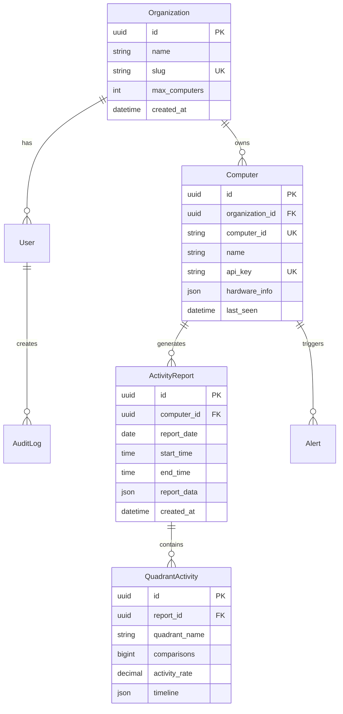
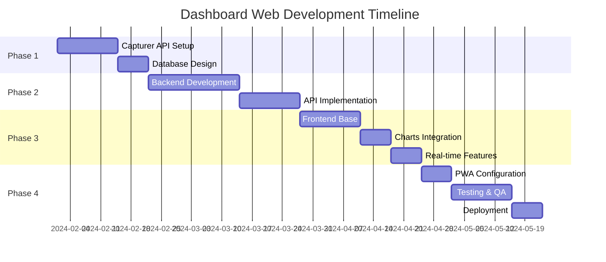

# 📋 Dashboard Web - Documento de Requerimientos Técnicos

## 1. INFORMACIÓN GENERAL

### 1.1 Propósito del Documento
Este documento define los requerimientos técnicos, funcionales y no funcionales para el desarrollo del **Capturer Dashboard Web**, una aplicación web separada que servirá como centro de administración y monitoreo para múltiples instancias de Capturer Desktop.

### 1.2 Alcance del Proyecto
- **Aplicación Web Independiente**: Dashboard administrativo separado de Capturer Desktop
- **Multi-tenant**: Soporte para múltiples organizaciones
- **Multi-device**: Acceso desde PC, tablet y móvil
- **Real-time**: Actualizaciones en tiempo real de métricas
- **Analytics**: Análisis avanzado de productividad y actividad

### 1.3 Stakeholders
| Rol | Responsabilidad | Contacto |
|-----|----------------|----------|
| Product Owner | Decisiones de negocio | - |
| Tech Lead | Arquitectura técnica | - |
| Developer | Implementación | - |
| QA Engineer | Testing y calidad | - |
| End Users | Administradores/Supervisores | - |

---

## 2. ARQUITECTURA DE INTEGRACIÓN

### 2.1 Diagrama de Comunicación

```
┌─────────────────────────────────────────────────────────────────┐
│                    FLUJO DE COMUNICACIÓN                        │
├─────────────────────────────────────────────────────────────────┤
│                                                                  │
│  [Capturer Desktop]                    [Dashboard Web]          │
│        ↓                                      ↑                 │
│   1. Genera Activity Report                  │                  │
│        ↓                                      │                  │
│   2. Serializa a JSON (ActivityReportDto)    │                  │
│        ↓                                      │                  │
│   3. POST /api/reports ───────────────────→  │                  │
│        ↓                                      │                  │
│   4. API Key Validation ←─────────────────   │                  │
│        ↓                                      │                  │
│   5. 201 Created + ReportId ←────────────    │                  │
│        ↓                                      │                  │
│   6. Queue next report                       │                  │
│                                               ↓                  │
│                                          7. Process & Store     │
│                                               ↓                  │
│                                          8. Update Real-time    │
│                                               ↓                  │
│                                          9. Trigger Alerts      │
│                                                                  │
└─────────────────────────────────────────────────────────────────┘
```

### 2.2 Protocolo de Comunicación

#### 2.2.1 Autenticación y Seguridad
```yaml
Capturer → Dashboard:
  Method: API Key Authentication
  Header: X-API-Key: cap_[base64_key]
  Encryption: HTTPS/TLS 1.3
  
Dashboard → Capturer:
  Method: Command Invocation
  Auth: JWT Bearer Token
  Permissions: Based on user role
```

#### 2.2.2 Formato de Datos
```json
{
  "version": "4.0.0",
  "timestamp": "2024-01-20T10:30:00Z",
  "computerId": "uuid-hardware-based",
  "computerName": "PC-OFFICE-01",
  "report": {
    "date": "2024-01-20",
    "startTime": "08:00:00",
    "endTime": "18:00:00",
    "quadrants": [
      {
        "name": "Trabajo",
        "comparisons": 1200,
        "activities": 850,
        "activityRate": 70.83,
        "timeline": [...]
      }
    ]
  },
  "metadata": {
    "os": "Windows 11",
    "version": "3.1.2",
    "screenResolution": "1920x1080"
  }
}
```

### 2.3 Endpoints de Integración

#### 2.3.1 Capturer API (Puerto 8080)
```http
# Health Check
GET http://localhost:8080/api/v1/health
Response: 200 OK
{
  "status": "healthy",
  "version": "4.0.0",
  "uptime": "02:45:30"
}

# Get Current Status
GET http://localhost:8080/api/v1/status
Authorization: ApiKey cap_xxxxx
Response: 200 OK
{
  "isCapturing": true,
  "lastCapture": "2024-01-20T10:28:00Z",
  "screenshotsToday": 145,
  "currentActivity": 78.5
}

# Trigger Manual Capture
POST http://localhost:8080/api/v1/commands/capture
Authorization: ApiKey cap_xxxxx
Response: 202 Accepted
{
  "commandId": "cmd_12345",
  "status": "queued"
}

# Stream Activity Updates (SSE)
GET http://localhost:8080/api/v1/stream/activity
Authorization: ApiKey cap_xxxxx
Response: 200 OK (Server-Sent Events)
data: {"timestamp":"2024-01-20T10:30:00Z","activity":82.3,"quadrant":"Trabajo"}
```

#### 2.3.2 Dashboard API
```http
# Register Computer
POST https://dashboard.empresa.com/api/computers/register
Content-Type: application/json
{
  "computerId": "hardware-uuid",
  "computerName": "PC-OFFICE-01",
  "organizationCode": "ACME2024"
}
Response: 201 Created
{
  "apiKey": "cap_generated_key",
  "dashboardUrl": "https://dashboard.empresa.com",
  "syncInterval": 300
}

# Submit Activity Report
POST https://dashboard.empresa.com/api/reports
Authorization: ApiKey cap_xxxxx
Content-Type: application/json
{...report data...}
Response: 201 Created
{
  "reportId": "rpt_67890",
  "processed": true,
  "nextSyncTime": "2024-01-20T10:35:00Z"
}

# Get Computer Configuration
GET https://dashboard.empresa.com/api/computers/{id}/config
Authorization: ApiKey cap_xxxxx
Response: 200 OK
{
  "captureInterval": 1800,
  "quadrants": [...],
  "emailSettings": {...},
  "features": {
    "activityDashboard": true,
    "autoReports": true
  }
}
```

---

## 3. REQUERIMIENTOS FUNCIONALES

### 3.1 Módulo de Autenticación y Autorización

#### RF-AUTH-001: Sistema de Login
- **Descripción**: Sistema de autenticación multi-factor
- **Actores**: Administradores, Supervisores, Viewers
- **Precondiciones**: Usuario registrado en el sistema
- **Flujo Principal**:
  1. Usuario ingresa email/username y password
  2. Sistema valida credenciales
  3. Si tiene 2FA habilitado, solicita código
  4. Genera JWT token con claims
  5. Redirige a dashboard principal
- **Postcondiciones**: Sesión activa con permisos asignados

#### RF-AUTH-002: Gestión de Roles
```yaml
Roles:
  Admin:
    - Full system access
    - User management
    - Organization settings
    - All computers access
  
  Manager:
    - View all computers
    - Generate reports
    - Configure alerts
    - Limited settings
  
  Supervisor:
    - View assigned computers
    - Generate team reports
    - View team metrics
  
  Viewer:
    - Read-only access
    - View reports
    - No configuration
```

### 3.2 Módulo de Gestión de Computadoras

#### RF-COMP-001: Registro de Computadoras
- **Descripción**: Auto-registro de nuevas computadoras
- **Flujo**:
  1. Capturer envía solicitud de registro
  2. Dashboard valida organización
  3. Genera API Key única
  4. Almacena información de hardware
  5. Retorna configuración inicial

#### RF-COMP-002: Monitoreo de Estado
- **Descripción**: Vista en tiempo real del estado de computadoras
- **Características**:
  - Estado online/offline
  - Última actividad
  - Métricas actuales
  - Alertas activas
  - Historial de 24 horas

### 3.3 Módulo de Reportes y Analytics

#### RF-REP-001: Dashboard Principal
```javascript
// Widgets requeridos
const dashboardWidgets = {
  summary: {
    totalComputers: number,
    activeComputers: number,
    todayScreenshots: number,
    averageActivity: percentage
  },
  charts: {
    activityTimeline: 'line-chart',
    quadrantComparison: 'bar-chart',
    heatmap: 'heatmap-chart',
    computerStatus: 'donut-chart'
  },
  tables: {
    recentActivity: 'sortable-table',
    topPerformers: 'ranked-list',
    alerts: 'priority-queue'
  }
};
```

#### RF-REP-002: Generación de Reportes
- **Tipos de Reportes**:
  - Diario: Resumen de actividad del día
  - Semanal: Tendencias y comparativas
  - Mensual: Análisis profundo y KPIs
  - Personalizado: Rango de fechas específico
- **Formatos de Exportación**:
  - PDF (con gráficos)
  - Excel (datos raw)
  - CSV (para análisis)
  - API (JSON)

### 3.4 Módulo de Alertas y Notificaciones

#### RF-ALERT-001: Sistema de Alertas
```yaml
Alert Types:
  - Computer Offline:
      trigger: No activity > 30 min
      severity: Warning
      action: Email + Dashboard notification
  
  - Low Activity:
      trigger: Activity < 20% for 1 hour
      severity: Info
      action: Dashboard notification
  
  - High Activity:
      trigger: Activity > 95% sustained
      severity: Info
      action: Log for analysis
  
  - System Error:
      trigger: Sync failures > 3
      severity: Critical
      action: Email + SMS + Dashboard
```

### 3.5 Módulo de Configuración Remota

#### RF-CONFIG-001: Configuración Centralizada
- **Descripción**: Modificar configuración de Capturer remotamente
- **Configuraciones Disponibles**:
  - Intervalo de captura
  - Cuadrantes y regiones
  - Horarios de reporte
  - Destinatarios de email
  - Umbrales de actividad

---

## 4. REQUERIMIENTOS NO FUNCIONALES

### 4.1 Performance

#### RNF-PERF-001: Tiempos de Respuesta
```yaml
Metrics:
  - Page Load: < 2s (3G network)
  - API Response: < 100ms (p95)
  - Chart Render: < 500ms
  - Data Export: < 5s (10MB)
  - Real-time Update: < 1s latency
```

#### RNF-PERF-002: Capacidad
```yaml
System Capacity:
  - Concurrent Users: 100+
  - Computers Monitored: 500+
  - Reports Storage: 1TB+
  - API Requests: 10,000/min
  - WebSocket Connections: 1,000
```

### 4.2 Seguridad

#### RNF-SEC-001: Encriptación
- **Datos en Tránsito**: TLS 1.3 mínimo
- **Datos en Reposo**: AES-256
- **Passwords**: Argon2id hashing
- **API Keys**: SHA-256 + salt

#### RNF-SEC-002: Compliance
```yaml
Standards:
  - OWASP Top 10 compliance
  - GDPR data protection
  - ISO 27001 alignment
  - SOC 2 Type II ready
```

### 4.3 Disponibilidad

#### RNF-DISP-001: Uptime
- **SLA Target**: 99.9% (8.76 hours/year downtime)
- **Maintenance Window**: Domingos 2-4 AM
- **Backup**: Daily automated, 90-day retention
- **Recovery**: RTO < 4 hours, RPO < 1 hour

### 4.4 Usabilidad

#### RNF-USA-001: Responsive Design
```css
/* Breakpoints requeridos */
@media (max-width: 576px) { /* Mobile */ }
@media (max-width: 768px) { /* Tablet */ }
@media (max-width: 992px) { /* Desktop */ }
@media (max-width: 1200px) { /* Large Desktop */ }
```

#### RNF-USA-002: Accesibilidad
- **WCAG 2.1 Level AA** compliance
- **Keyboard Navigation** complete
- **Screen Reader** compatible
- **Color Contrast** 4.5:1 minimum

### 4.5 Compatibilidad

#### RNF-COMP-001: Navegadores
```yaml
Desktop:
  - Chrome 120+
  - Firefox 120+
  - Safari 16+
  - Edge 120+

Mobile:
  - Chrome Mobile
  - Safari iOS 16+
  - Samsung Internet
```

#### RNF-COMP-002: Sistemas Operativos
- **Capturer Client**: Windows 10/11
- **Dashboard Access**: Any OS with modern browser
- **API Compatibility**: REST/JSON standard

---

## 5. CASOS DE USO DETALLADOS

### 5.1 UC-001: Supervisor Revisa Actividad Diaria

```gherkin
Feature: Daily Activity Review
  As a Supervisor
  I want to review daily activity reports
  So that I can monitor team productivity

  Scenario: Review team activity for today
    Given I am logged in as a Supervisor
    And I have 5 computers assigned to my team
    When I navigate to the Dashboard page
    Then I should see activity summary for all 5 computers
    And I should see a timeline chart showing activity per hour
    And I should see alerts if any computer is offline
    
  Scenario: Drill down into specific computer
    Given I am viewing the dashboard
    When I click on "PC-JOHN-01"
    Then I should see detailed activity for that computer
    And I should see quadrant-specific metrics
    And I should be able to export the data
```

### 5.2 UC-002: Administrador Configura Alertas

```gherkin
Feature: Alert Configuration
  As an Administrator
  I want to configure custom alerts
  So that I can be notified of important events

  Scenario: Create low activity alert
    Given I am in the Alerts configuration page
    When I create a new alert with:
      | Field           | Value                |
      | Name            | Low Activity Alert   |
      | Trigger         | Activity < 30%       |
      | Duration        | 30 minutes          |
      | Severity        | Warning             |
      | Notification    | Email + Dashboard   |
      | Recipients      | supervisor@acme.com |
    Then the alert should be saved
    And it should be active immediately
```

### 5.3 UC-003: Sistema Sincroniza Datos

```gherkin
Feature: Automatic Data Synchronization
  As the System
  I want to automatically sync data from Capturer clients
  So that the dashboard always shows current information

  Background:
    Given Capturer client "PC-OFFICE-01" is running
    And it has API key "cap_abc123"
    And Dashboard API is accessible

  Scenario: Successful activity sync
    When Capturer generates an activity report at 10:30 AM
    Then it should POST the report to /api/reports
    And include the API key in headers
    And Dashboard should respond with 201 Created
    And the report should appear in real-time feed
    
  Scenario: Handle sync failure
    When Capturer fails to sync due to network error
    Then it should queue the report locally
    And retry after 1 minute
    And continue retrying with exponential backoff
    And alert user after 3 failures
```

---

## 6. MODELO DE DATOS

### 6.1 Diagrama ER Principal



### 6.2 Índices y Optimizaciones

```sql
-- Performance indexes
CREATE INDEX idx_reports_computer_date 
ON activity_reports(computer_id, report_date DESC);

CREATE INDEX idx_reports_date_partial 
ON activity_reports(report_date DESC) 
WHERE created_at > CURRENT_DATE - INTERVAL '90 days';

CREATE INDEX idx_alerts_unread 
ON alerts(organization_id, is_acknowledged) 
WHERE is_acknowledged = false;

-- Materialized view for dashboard
CREATE MATERIALIZED VIEW dashboard_summary AS
SELECT 
    o.id as org_id,
    COUNT(DISTINCT c.id) as total_computers,
    COUNT(DISTINCT CASE WHEN c.last_seen > NOW() - INTERVAL '30 minutes' 
           THEN c.id END) as active_computers,
    AVG(ar.average_activity_rate) as avg_activity,
    COUNT(DISTINCT ar.id) as reports_today
FROM organizations o
LEFT JOIN computers c ON c.organization_id = o.id
LEFT JOIN activity_reports ar ON ar.computer_id = c.id 
    AND ar.report_date = CURRENT_DATE
GROUP BY o.id;

-- Refresh every 5 minutes
CREATE OR REPLACE FUNCTION refresh_dashboard_summary()
RETURNS void AS $$
BEGIN
    REFRESH MATERIALIZED VIEW CONCURRENTLY dashboard_summary;
END;
$$ LANGUAGE plpgsql;
```

---

## 7. INTERFACES DE USUARIO

### 7.1 Wireframes Principales

#### Dashboard Principal
```
┌────────────────────────────────────────────────────────────┐
│ 🏢 ACME Corp - Capturer Dashboard          👤 Admin ⚙️ 🔔 │
├────────────────────────────────────────────────────────────┤
│                                                             │
│ ┌─────────┬─────────┬─────────┬─────────┐                │
│ │   12    │  2,847  │   78%   │    24   │                │
│ │ Active  │ Screenshots│ Activity│ Alerts │                │
│ └─────────┴─────────┴─────────┴─────────┘                │
│                                                             │
│ ┌─────────────────────────────┬───────────────┐           │
│ │ 📈 Activity Timeline        │ 🖥️ Computers  │           │
│ │ [Line Chart Area]           │ ┌───────────┐ │           │
│ │                              │ │ Online: 10│ │           │
│ │                              │ │ Offline: 2│ │           │
│ │                              │ │ Warning: 0│ │           │
│ └─────────────────────────────┴───────────────┘           │
│                                                             │
│ ┌──────────────────────────────────────────────┐          │
│ │ 📊 Recent Activity                           │          │
│ ├────────────┬──────────┬──────────┬──────────┤          │
│ │ Computer   │ Status   │ Activity │ Action   │          │
│ ├────────────┼──────────┼──────────┼──────────┤          │
│ │ PC-JOHN-01 │ 🟢 Online│ 85%      │ View →   │          │
│ │ PC-MARY-02 │ 🟢 Online│ 72%      │ View →   │          │
│ │ PC-DESK-03 │ 🔴 Offline│ --      │ Check →  │          │
│ └────────────┴──────────┴──────────┴──────────┘          │
└────────────────────────────────────────────────────────────┘
```

#### Computer Detail View
```
┌────────────────────────────────────────────────────────────┐
│ ← Back   PC-JOHN-01 - Detail View          📥 Export 🔧   │
├────────────────────────────────────────────────────────────┤
│                                                             │
│ Status: 🟢 Online | Last Seen: 2 min ago | Version: 4.0.1 │
│                                                             │
│ ┌──────────────────────────────────────────────┐          │
│ │ Today's Activity by Quadrant                  │          │
│ │ [Stacked Bar Chart]                           │          │
│ │ ████████░░ Work (80%)                        │          │
│ │ ██████░░░░ Dashboard (60%)                   │          │
│ │ ███░░░░░░░ Email (30%)                       │          │
│ └──────────────────────────────────────────────┘          │
│                                                             │
│ ┌──────────────────────────────────────────────┐          │
│ │ 📅 Weekly Heatmap                             │          │
│ │ [Heatmap Visualization]                       │          │
│ │ Mon [▓▓▓▓▓▓▓▓░░░░░░░░]                      │          │
│ │ Tue [▓▓▓▓▓▓▓▓▓░░░░░░░]                      │          │
│ │ Wed [▓▓▓▓▓▓▓░░░░░░░░░]                      │          │
│ └──────────────────────────────────────────────┘          │
│                                                             │
│ [Configure] [View Reports] [Set Alerts] [Remote Control]   │
└────────────────────────────────────────────────────────────┘
```

### 7.2 Guía de Estilos UI

```css
/* Color Palette */
:root {
  --primary: #0066CC;
  --secondary: #6C757D;
  --success: #28A745;
  --warning: #FFC107;
  --danger: #DC3545;
  --info: #17A2B8;
  
  --bg-primary: #FFFFFF;
  --bg-secondary: #F8F9FA;
  --text-primary: #212529;
  --text-secondary: #6C757D;
  
  --border: #DEE2E6;
  --shadow: 0 2px 4px rgba(0,0,0,0.1);
}

/* Typography */
.heading-1 { font-size: 2rem; font-weight: 600; }
.heading-2 { font-size: 1.5rem; font-weight: 600; }
.body-text { font-size: 1rem; line-height: 1.5; }
.small-text { font-size: 0.875rem; color: var(--text-secondary); }

/* Components */
.card {
  background: var(--bg-primary);
  border: 1px solid var(--border);
  border-radius: 8px;
  box-shadow: var(--shadow);
  padding: 1.5rem;
}

.button-primary {
  background: var(--primary);
  color: white;
  border: none;
  border-radius: 4px;
  padding: 0.5rem 1rem;
  cursor: pointer;
  transition: opacity 0.2s;
}

.button-primary:hover {
  opacity: 0.9;
}
```

---

## 8. PLAN DE TESTING

### 8.1 Estrategia de Testing

```yaml
Testing Pyramid:
  Unit Tests: 70%
    - Business logic
    - Data validation
    - Service methods
    
  Integration Tests: 20%
    - API endpoints
    - Database operations
    - External services
    
  E2E Tests: 10%
    - Critical user flows
    - Cross-browser testing
    - Performance testing
```

### 8.2 Test Cases Críticos

#### TC-001: Computer Registration
```javascript
describe('Computer Registration', () => {
  it('should register new computer with valid data', async () => {
    const response = await api.post('/api/computers/register', {
      computerId: 'test-hardware-id',
      computerName: 'TEST-PC-01',
      organizationCode: 'TEST123'
    });
    
    expect(response.status).toBe(201);
    expect(response.data).toHaveProperty('apiKey');
    expect(response.data.apiKey).toMatch(/^cap_/);
  });
  
  it('should reject duplicate computer registration', async () => {
    // First registration
    await api.post('/api/computers/register', validData);
    
    // Duplicate attempt
    const response = await api.post('/api/computers/register', validData);
    
    expect(response.status).toBe(409);
    expect(response.data.error).toBe('Computer already registered');
  });
});
```

#### TC-002: Activity Report Sync
```javascript
describe('Activity Report Sync', () => {
  it('should accept valid activity report', async () => {
    const report = generateMockReport();
    
    const response = await api.post('/api/reports', report, {
      headers: { 'X-API-Key': validApiKey }
    });
    
    expect(response.status).toBe(201);
    expect(response.data.reportId).toBeDefined();
  });
  
  it('should handle network failures gracefully', async () => {
    // Simulate network failure
    nock('https://dashboard.local')
      .post('/api/reports')
      .replyWithError('Network error');
    
    const result = await capturerClient.syncReport(report);
    
    expect(result.success).toBe(false);
    expect(result.queued).toBe(true);
    expect(result.retryAt).toBeDefined();
  });
});
```

### 8.3 Performance Testing

```javascript
// k6 Load Test Script
import http from 'k6/http';
import { check, sleep } from 'k6';

export let options = {
  stages: [
    { duration: '2m', target: 100 }, // Ramp up
    { duration: '5m', target: 100 }, // Stay at 100 users
    { duration: '2m', target: 0 },   // Ramp down
  ],
  thresholds: {
    http_req_duration: ['p(95)<500'], // 95% of requests under 500ms
    http_req_failed: ['rate<0.1'],    // Error rate under 10%
  },
};

export default function() {
  // Test Dashboard API
  let response = http.get('https://dashboard.local/api/dashboard/overview', {
    headers: { 'Authorization': 'Bearer ' + __ENV.TOKEN },
  });
  
  check(response, {
    'status is 200': (r) => r.status === 200,
    'response time < 500ms': (r) => r.timings.duration < 500,
  });
  
  sleep(1);
}
```

---

## 9. DEPLOYMENT Y DEVOPS

### 9.1 CI/CD Pipeline

```yaml
# .github/workflows/dashboard-pipeline.yml
name: Dashboard CI/CD

on:
  push:
    branches: [main, develop]
  pull_request:
    branches: [main]

jobs:
  test:
    runs-on: ubuntu-latest
    steps:
      - uses: actions/checkout@v3
      
      - name: Setup .NET
        uses: actions/setup-dotnet@v3
        with:
          dotnet-version: '8.0.x'
      
      - name: Restore dependencies
        run: dotnet restore
      
      - name: Build
        run: dotnet build --no-restore
      
      - name: Test
        run: dotnet test --no-build --verbosity normal --collect:"XPlat Code Coverage"
      
      - name: Upload coverage
        uses: codecov/codecov-action@v3

  build:
    needs: test
    runs-on: ubuntu-latest
    if: github.ref == 'refs/heads/main'
    
    steps:
      - uses: actions/checkout@v3
      
      - name: Build Docker image
        run: |
          docker build -t capturer-dashboard:${{ github.sha }} .
          docker tag capturer-dashboard:${{ github.sha }} capturer-dashboard:latest
      
      - name: Push to registry
        run: |
          echo ${{ secrets.DOCKER_PASSWORD }} | docker login -u ${{ secrets.DOCKER_USERNAME }} --password-stdin
          docker push capturer-dashboard:${{ github.sha }}
          docker push capturer-dashboard:latest

  deploy:
    needs: build
    runs-on: ubuntu-latest
    if: github.ref == 'refs/heads/main'
    
    steps:
      - name: Deploy to production
        run: |
          ssh ${{ secrets.PROD_SERVER }} "
            docker pull capturer-dashboard:latest
            docker stop capturer-dashboard || true
            docker rm capturer-dashboard || true
            docker run -d --name capturer-dashboard \
              -p 443:443 \
              -e ConnectionString='${{ secrets.DB_CONNECTION }}' \
              -e JwtSecret='${{ secrets.JWT_SECRET }}' \
              capturer-dashboard:latest
          "
```

### 9.2 Infrastructure as Code

```terraform
# infrastructure/main.tf
provider "azurerm" {
  features {}
}

resource "azurerm_resource_group" "capturer" {
  name     = "rg-capturer-dashboard"
  location = "East US"
}

resource "azurerm_app_service_plan" "capturer" {
  name                = "asp-capturer-dashboard"
  location            = azurerm_resource_group.capturer.location
  resource_group_name = azurerm_resource_group.capturer.name
  kind                = "Linux"
  reserved            = true
  
  sku {
    tier = "Standard"
    size = "S1"
  }
}

resource "azurerm_app_service" "dashboard" {
  name                = "capturer-dashboard"
  location            = azurerm_resource_group.capturer.location
  resource_group_name = azurerm_resource_group.capturer.name
  app_service_plan_id = azurerm_app_service_plan.capturer.id
  
  site_config {
    linux_fx_version = "DOCKER|capturer-dashboard:latest"
    always_on        = true
  }
  
  app_settings = {
    "WEBSITES_ENABLE_APP_SERVICE_STORAGE" = "false"
    "DOCKER_REGISTRY_SERVER_URL"          = "https://index.docker.io"
    "WEBSITES_PORT"                        = "80"
  }
  
  connection_string {
    name  = "DefaultConnection"
    type  = "PostgreSQL"
    value = azurerm_postgresql_server.capturer.connection_string
  }
}

resource "azurerm_postgresql_server" "capturer" {
  name                = "psql-capturer-dashboard"
  location            = azurerm_resource_group.capturer.location
  resource_group_name = azurerm_resource_group.capturer.name
  
  sku_name = "B_Gen5_1"
  
  storage_mb                   = 5120
  backup_retention_days        = 7
  geo_redundant_backup_enabled = false
  auto_grow_enabled            = true
  
  administrator_login          = "capturadmin"
  administrator_login_password = var.db_password
  version                      = "11"
  ssl_enforcement_enabled      = true
}
```

---

## 10. ESTIMACIÓN Y CRONOGRAMA

### 10.1 Estimación de Esfuerzo

| Módulo | Complejidad | Horas Dev | Horas QA | Total |
|--------|------------|-----------|----------|-------|
| Authentication | Media | 40 | 10 | 50 |
| Computer Management | Alta | 60 | 15 | 75 |
| Activity Reports | Alta | 80 | 20 | 100 |
| Real-time Updates | Alta | 40 | 10 | 50 |
| Charts & Analytics | Media | 60 | 15 | 75 |
| Alerts System | Media | 30 | 8 | 38 |
| PWA Setup | Baja | 20 | 5 | 25 |
| API Integration | Alta | 50 | 12 | 62 |
| **TOTAL** | - | **380** | **95** | **475** |

### 10.2 Cronograma Gantt



---

## 11. RIESGOS Y MITIGACIÓN

### 11.1 Matriz de Riesgos

| ID | Riesgo | Probabilidad | Impacto | Mitigación |
|----|--------|--------------|---------|------------|
| R01 | Latencia de red alta entre Capturer y Dashboard | Media | Alto | Implementar queue local y retry logic |
| R02 | Sobrecarga de base de datos con múltiples clientes | Media | Alto | Implementar caching y particionamiento |
| R03 | Incompatibilidad de versiones Capturer/Dashboard | Baja | Alto | Versionado de API y backward compatibility |
| R04 | Ataques de seguridad en API expuesta | Media | Crítico | Rate limiting, WAF, API key rotation |
| R05 | Complejidad de deployment multi-tenant | Alta | Media | Containerización y orquestación con K8s |

### 11.2 Plan de Contingencia

```yaml
Scenario: Dashboard unavailable
  Detection: Health check failures
  Impact: Capturer clients cannot sync
  Response:
    - Capturer queues reports locally (up to 7 days)
    - Admin receives alert via SMS
    - Failover to backup instance
    - Data reconciliation on recovery
    
Scenario: Data breach detected
  Detection: Anomaly in audit logs
  Impact: Potential data exposure
  Response:
    - Immediate API key rotation
    - Force password reset for affected users
    - Security audit execution
    - Stakeholder notification per GDPR
```

---

## 12. GLOSARIO

| Término | Definición |
|---------|------------|
| **Activity Report** | Reporte generado por Capturer con métricas de actividad |
| **API Key** | Token único para autenticar computadoras Capturer |
| **Dashboard** | Interfaz web para monitoreo y administración |
| **Quadrant** | Región específica de la pantalla monitoreada |
| **Sync** | Proceso de sincronización de datos Capturer → Dashboard |
| **JWT** | JSON Web Token para autenticación de usuarios |
| **PWA** | Progressive Web App, aplicación web instalable |
| **SSE** | Server-Sent Events para actualizaciones real-time |
| **Multi-tenant** | Arquitectura que soporta múltiples organizaciones |

---

## 13. APÉNDICES

### A. Ejemplos de Código

#### A.1 Modelo de Activity Report
```csharp
public class ActivityReportDto
{
    public Guid Id { get; set; }
    public string ComputerId { get; set; }
    public string ComputerName { get; set; }
    public DateTime ReportDate { get; set; }
    public TimeSpan StartTime { get; set; }
    public TimeSpan EndTime { get; set; }
    
    public List<QuadrantActivityDto> Quadrants { get; set; }
    
    public Dictionary<string, object> Metadata { get; set; }
    
    public string Version { get; set; } = "4.0.0";
    
    public DateTime CreatedAt { get; set; } = DateTime.UtcNow;
}
```

#### A.2 API Client en Capturer
```csharp
public class DashboardApiClient
{
    private readonly HttpClient _httpClient;
    private readonly string _apiKey;
    
    public async Task<bool> SendReportAsync(ActivityReportDto report)
    {
        try
        {
            _httpClient.DefaultRequestHeaders.Add("X-API-Key", _apiKey);
            
            var json = JsonSerializer.Serialize(report);
            var content = new StringContent(json, Encoding.UTF8, "application/json");
            
            var response = await _httpClient.PostAsync("/api/reports", content);
            
            return response.IsSuccessStatusCode;
        }
        catch (Exception ex)
        {
            Logger.LogError(ex, "Failed to send report");
            return false;
        }
    }
}
```

### B. Referencias

1. [ASP.NET Core Documentation](https://docs.microsoft.com/aspnet/core)
2. [Entity Framework Core](https://docs.microsoft.com/ef/core)
3. [Chart.js Documentation](https://www.chartjs.org/docs)
4. [Progressive Web Apps](https://web.dev/progressive-web-apps)
5. [OWASP Security Guidelines](https://owasp.org/www-project-top-ten)

---

## 14. APROBACIONES

| Rol | Nombre | Firma | Fecha |
|-----|--------|-------|-------|
| Product Owner | - | - | - |
| Tech Lead | - | - | - |
| QA Lead | - | - | - |
| Security Officer | - | - | - |

---

**Documento Versión**: 1.0.0  
**Fecha**: 2024-01-20  
**Estado**: DRAFT  
**Próxima Revisión**: 2024-02-01