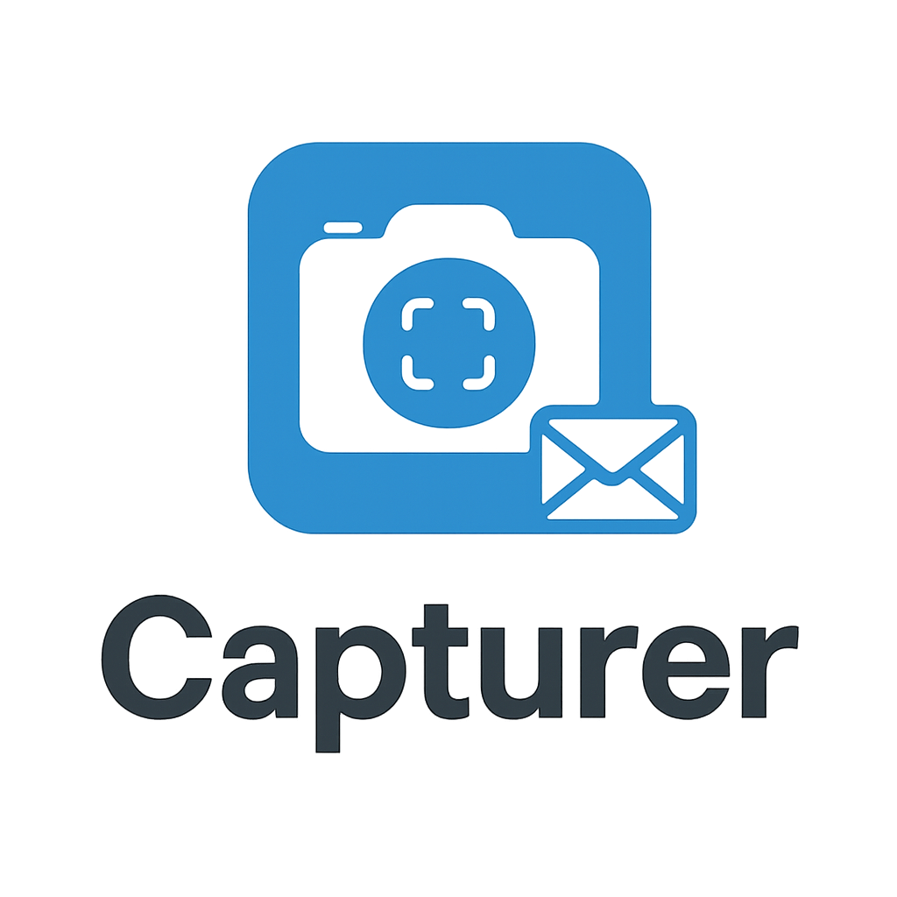

# 📸 Capturer v3.1.2 - Tu Asistente Personal de Capturas



**Capturer** es una aplicación muy sencilla que toma fotografías de tu pantalla automáticamente y te las envía por correo electrónico. Es como tener un asistente que documenta tu trabajo sin que tengas que recordarlo.

🎯 **Perfecto para**: Documentar tu trabajo diario, crear reportes de actividad, mantener registro visual de tus actividades, o simplemente tener un respaldo de lo que haces en la computadora.

---

## 📋 ¿Qué puedes hacer con Capturer?

### 📸 **Capturas Automáticas**
- Toma fotos de tu pantalla cada cierto tiempo (15 min, 30 min, 1 hora, etc.)
- Funciona solo en segundo plano
- Las guarda organizadas con fecha y hora

### 📧 **Envío por Email**
- Te envía las fotos por correo automáticamente
- Puedes elegir recibirlas diariamente o semanalmente
- También puedes enviar fotos manualmente cuando quieras

### 📊 **Dashboard de Actividad**
- Ve en tiempo real qué tan activa está tu computadora
- Analiza diferentes áreas de la pantalla por separado
- Genera reportes automáticos con gráficos

### 🧩 **Cuadrantes (Áreas Específicas)**
- Enfócate solo en partes importantes de tu pantalla
- Ideal para privacidad (ocultar áreas personales)
- Reportes separados por cada área

---

## 🚀 Empezar a Usar Capturer

### 1️⃣ **Abrir el Programa**

1. Busca el archivo **"Capturer.exe"** en tu carpeta
2. Haz doble clic para abrirlo
3. Verás la ventana principal con todos los controles

### 2️⃣ **La Ventana Principal**

```
┌─────────────────────────────────────────────────┐
│ 📸 Capturer v3.1.2 - Sistema de Monitoreo      │
├─────────────────────────────────────────────────┤
│ Estado: Detenido        Próxima: --:--          │
│ Total fotos: 0          Almacenamiento: 0 MB    │
│ Último email: Nunca     Estado email: Sin config│
├─────────────────────────────────────────────────┤
│ [▶ Iniciar] [⏹ Detener] [⚙ Configurar] [📧 Email]│
│                    [📊 Dashboard]               │
├─────────────────────────────────────────────────┤
│ Fotos Recientes:                               │
│ (Aún no hay fotos)                             │
└─────────────────────────────────────────────────┘
```

#### **¿Qué significa cada cosa?**

- **Estado**: Te dice si está tomando fotos o no
- **Próxima**: Cuándo será la siguiente foto
- **Total fotos**: Cuántas fotos ha tomado hasta ahora
- **Almacenamiento**: Cuánto espacio ocupan las fotos

#### **Los Botones Principales**
- 🟢 **[▶ Iniciar]**: Empezar a tomar fotos automáticamente
- 🔴 **[⏹ Detener]**: Parar de tomar fotos
- ⚙️ **[⚙ Configurar]**: Cambiar la configuración
- 📧 **[📧 Email]**: Enviar fotos por correo
- 📊 **[📊 Dashboard]**: Ver análisis de actividad

---

## ⚙️ Configurar la Aplicación

### **Paso 1: Abrir la Configuración**
Haz clic en el botón **[⚙ Configurar]** para abrir la ventana de configuración.

Verás 4 pestañas principales:

### 📸 **Pestaña "Capturas"**

#### **¿Cada cuánto quieres fotos?**
```
Intervalo de captura: [30] minutos
```
**Opciones recomendadas:**
- **15 minutos**: Muchas fotos (para trabajo detallado)
- **30 minutos**: Intermedio (bueno para empezar) ⭐ **RECOMENDADO**
- **60 minutos**: Pocas fotos (para uso ocasional)

#### **¿Dónde se guardan?**
```
Carpeta: C:\Users\[TuNombre]\Documents\Capturer\Screenshots
```
*No cambies esto a menos que sepas exactamente dónde quieres guardarlas*

#### **¿Empezar automáticamente?**
```
☑ Iniciar captura automáticamente al abrir el programa
```
*Recomendado: déjalo marcado*

#### **Configuración de Pantalla**
```
Modo de captura: [Todas las pantallas ▼]
```
**Opciones:**
- **Todas las pantallas**: Captura todos los monitores (recomendado)
- **Pantalla principal**: Solo el monitor principal
- **Pantalla específica**: Elegir un monitor en particular

### 📧 **Pestaña "Email"**

Esta es la configuración más importante para recibir tus reportes.

#### **Configuración del Servidor Email**

**Si usas Gmail:**
```
Servidor SMTP: smtp.gmail.com
Puerto: 587
```

**Si usas Outlook:**
```
Servidor SMTP: smtp-mail.outlook.com
Puerto: 587
```

#### **Tu Información de Email**
```
Usuario: tu_email@gmail.com
Contraseña: **************** [👁] ← Click para ver/ocultar
Nombre para envío: Capturer - [Tu Nombre]
```

**¡IMPORTANTE!** Para Gmail necesitas una "contraseña de aplicación":
1. Ve a tu cuenta de Google
2. Busca "Verificación en 2 pasos" y actívala
3. Busca "Contraseñas de aplicaciones"
4. Crea una nueva para "Capturer"
5. Usa esa contraseña de 16 dígitos (no tu contraseña normal)

#### **¿A quién enviar los reportes?**
```
Destinatarios: jefe@empresa.com; tu_email@gmail.com
```
*Separa múltiples emails con punto y coma (;)*

#### **Prueba tu Configuración**
```
[🧪 Probar Conexión] ← ¡HAZ ESTO ANTES DE GUARDAR!
```
- ✅ "Conexión exitosa" = Todo está bien
- ❌ "Error" = Revisa tus datos

### 💾 **Pestaña "Almacenamiento"**

#### **¿Cuánto espacio usar?**
```
Retener archivos por: [90] días
Tamaño máximo: [5] GB
☑ Limpieza automática
```

**¿Cómo funciona?**
- Las fotos más viejas se borran automáticamente
- Si se llena el espacio, borra las más antiguas primero
- No tienes que preocuparte por el espacio

### 🖥️ **Pestaña "Aplicación"**

#### **Configuración del Sistema**
```
☑ Minimizar a la barra de tareas (system tray)
☑ Mostrar notificaciones
☐ Iniciar con Windows
```

**¿Qué hace cada opción?**
- **Minimizar a barra**: Al cerrar, se va al área de notificaciones
- **Notificaciones**: Te avisa cuando toma fotos o envía emails  
- **Iniciar con Windows**: Se abre automáticamente al prender la PC

---

## 📊 Dashboard de Actividad

### **¿Qué es el Dashboard?**

El Dashboard es una ventana especial que te muestra **en tiempo real** qué tan activa está tu computadora. Es como un monitor que analiza cambios en tu pantalla.

### **Abrir el Dashboard**

1. En la ventana principal, haz clic en **[📊 Dashboard]**
2. Se abrirá una nueva ventana con información en vivo

### **¿Qué verás en el Dashboard?**

```
┌─────────────────────┬─────────────────────┬─────────────┐
│ 📊 Barras Actividad │ 📋 Tabla Detallada  │ ⚙️ Config   │
│                     │                     │             │
│ Trabajo: ████████   │ Cuadrante | Activid │ 📅 Reportes │
│ Email:   ████░░░░   │ Trabajo   | 85%     │ ⚙️ Configurar│
│ Personal: ██░░░░░░  │ Email     | 45%     │ ⏸ Pausar    │
│                     │ Personal  | 15%     │             │
└─────────────────────┴─────────────────────┴─────────────┘
```

#### **Panel Izquierdo: Barras de Actividad**
- Cada barra representa un área de tu pantalla
- Más llena = más actividad en esa área
- Se actualiza en tiempo real

#### **Panel Centro: Tabla de Estadísticas**
- **Cuadrante**: Nombre del área
- **Comparaciones**: Cuántas veces se ha verificado
- **Actividades**: Cuántos cambios se detectaron
- **Tasa**: Porcentaje de actividad

#### **Panel Derecho: Configuración**
- **📅 Reportes**: Configurar reportes automáticos
- **⚙️ Configurar**: Configuración del dashboard
- **⏸ Pausar**: Pausar el monitoreo

### **Configurar Cuadrantes (Áreas de la Pantalla)**

Los cuadrantes te permiten dividir tu pantalla en áreas específicas.

#### **¿Por qué usar cuadrantes?**
- 🎯 **Enfocar análisis**: Solo en áreas importantes
- 🔒 **Privacidad**: Excluir partes personales
- 📊 **Reportes específicos**: Analizar productividad por área

#### **Cómo configurar:**
1. En el Dashboard, haz clic en **[⚙️ Configurar]**
2. Define las áreas que te interesan:
   ```
   Cuadrante "Trabajo":
   - Posición: Esquina superior izquierda
   - Tamaño: 800x600 píxeles
   - Color: Azul (para identificación)
   ```

3. Puedes crear varios cuadrantes:
   - **Trabajo**: Aplicaciones de trabajo
   - **Email**: Cliente de correo
   - **Personal**: Área personal

---

## 📧 Envío de Emails y Reportes

### **Tipos de Envío**

#### 📩 **Email Manual (Cuando tú quieras)**

1. Haz clic en **[📧 Email]** en la ventana principal
2. Selecciona el período:
   ```
   Desde: [Hoy ▼]     Hasta: [Hoy ▼]
   
   Atajos rápidos:
   [Hoy] [Últimos 7 días] [Este mes]
   ```
3. Elige destinatarios y formato
4. Haz clic en **[📧 Enviar]**

#### 📅 **Reportes Automáticos (Sin que hagas nada)**

Desde el **Dashboard**, configura reportes que se envían solos:

1. En el Dashboard, haz clic en **[📅 Reportes]**
2. Configura qué tipo de reporte quieres:

#### **🗓️ Reportes Diarios**
```
📅 ¿Cuándo quiere recibir reportes?
○ Diario - Recibir reporte HTML cada día seleccionado

📅 Recibir reporte HTML estos días:
☑ Lunes ☑ Martes ☑ Miércoles ☑ Jueves ☑ Viernes
☐ Sábado ☐ Domingo

⏰ Hora de envío: [18:00 ▼] (Final del día)
```

**¿Qué recibirás?**
- Un email cada día seleccionado
- Un archivo HTML con gráficos de actividad
- Análisis detallado de tu productividad

#### **📦 Reportes Semanales**
```
📦 ¿Cuándo quiere recibir reportes?  
○ Semanal - Recibir ZIP con 7 reportes HTML cada semana

📦 Enviar ZIP cada: [Lunes ▼]
⏰ Hora de envío: [09:00 ▼] (Inicio de semana)
```

**¿Qué recibirás?**
- Un email cada semana
- Un archivo ZIP con 7 reportes HTML (uno por cada día)
- Resumen completo de la semana

### **Configuración de Cuadrantes para Reportes**

```
🧩 ¿Qué cuadrantes incluir en los reportes?

Configuración de cuadrantes: [Oficina Principal ▼]

Cuadrantes a incluir:
☑ Trabajo     - Aplicaciones de productividad
☑ Dashboard   - Métricas y análisis  
☐ Personal    - Área privada
☑ Email       - Cliente de correo
```

### **Configuración de Monitoreo**

```
⚙️ ¿Cómo monitorear la actividad?

Intervalo de verificación: [5] minutos
Umbral de actividad: [2.0] % cambio
Tolerancia píxel: [10] píxeles
```

**¿Qué significa esto?**
- **Intervalo**: Cada cuánto tiempo revisa cambios
- **Umbral**: Qué tanto cambio necesita para considerarlo "actividad"
- **Tolerancia**: Cuántos píxeles pueden cambiar sin contar como actividad

### **Destinatarios y Pruebas**

```
📧 ¿Quién debe recibir los reportes?
☑ admin@empresa.com      [➕ Agregar]
☑ supervisor@empresa.com [➖ Quitar]  
☐ gerente@empresa.com

🧪 Pruebas de Configuración
[📧 Enviar Email de Prueba AHORA] [✅ Validar Config]
```

**Funciones de Prueba:**
- **Email de Prueba**: Envía un email real para verificar que funciona
- **Validar Config**: Verifica que todo está configurado correctamente

### **Vista Previa**

```
📅 Vista Previa - ¿Cuándo llegarán los reportes?

📅 CONFIGURACIÓN: Reportes HTML diarios  
⏰ Hora de envío: 18:00
🗓️ Días seleccionados: Lun, Mar, Mié, Jue, Vie

⚙️ CONFIGURACIÓN DE MONITOREO:
🧩 Cuadrantes: Trabajo, Dashboard, Email
⏱️ Intervalo: Cada 5 minutos  
🎯 Umbral: 2.0% cambio de píxeles
📧 Destinatarios: 2

📅 PRÓXIMOS ENVÍOS:
📧 Lunes HOY
📧 Martes Mañana  
📧 Miércoles 11/09
```

---

## 🔧 Configuración Paso a Paso

### **📸 Configurar las Capturas**

#### **Paso 1: Decidir la Frecuencia**
```
¿Cada cuánto tomar fotos?

Para principiantes: 30 minutos ⭐
Para trabajo intenso: 15 minutos
Para uso ocasional: 60 minutos  
```

#### **Paso 2: Elegir la Carpeta**
Las fotos se guardan en:
```
C:\Users\[TuNombre]\Documents\Capturer\Screenshots
```

#### **Paso 3: Configuración Avanzada**
```
☑ Incluir cursor del mouse en las fotos
☑ Iniciar automáticamente al abrir Capturer
🖥️ Capturar: [Todas las pantallas ▼]
```

### **📧 Configurar el Email (¡Importante!)**

#### **Paso 1: Información del Servidor**

**Para Gmail:**
```
Servidor: smtp.gmail.com
Puerto: 587
Seguridad: ☑ Usar SSL/TLS
```

**Para Outlook:**
```
Servidor: smtp-mail.outlook.com  
Puerto: 587
Seguridad: ☑ Usar SSL/TLS
```

#### **Paso 2: Tu Información**
```
Email: tu_correo@gmail.com
Contraseña: **************** [👁]
```

**🔑 Para Gmail (MUY IMPORTANTE):**
1. Ve a [myaccount.google.com](https://myaccount.google.com)
2. Busca "Seguridad" → "Verificación en 2 pasos" → Activar
3. Busca "Contraseñas de aplicaciones" → Crear nueva
4. Selecciona "Correo" y "Windows Computer"
5. Usa la contraseña de 16 dígitos que te da

#### **Paso 3: Destinatarios**
```
¿A quién enviar?
jefe@empresa.com; tu_correo@gmail.com; supervisor@empresa.com
```
*Separa múltiples emails con punto y coma (;)*

#### **Paso 4: PROBAR**
```
[🧪 Probar Conexión] ← ¡HAZ CLICK AQUÍ!
```
- ✅ Si dice "Éxito" = Listo para usar
- ❌ Si dice "Error" = Revisa los datos

### **💾 Configurar el Almacenamiento**

#### **¿Cuántas fotos mantener?**
```
Retener archivos por: [90] días

¿Qué significa?
- Fotos más viejas de 90 días se borran automáticamente
- No tienes que preocuparte por el espacio
```

#### **¿Cuánto espacio máximo?**
```
Tamaño máximo de carpeta: [5] GB

¿Qué pasa cuando se llena?
- Se borran las fotos más viejas primero
- Siempre mantiene el espacio controlado
```

#### **Limpieza Automática**
```
☑ Habilitar limpieza automática

¿Cuándo limpia?
- Todos los días a las 3:00 AM
- También cuando se llena el espacio
```

### **🖥️ Configurar la Aplicación**

#### **Opciones de la Barra de Tareas**
```
☑ Minimizar a la bandeja del sistema (system tray)
```
**¿Qué hace?** Cuando cierres la ventana, Capturer sigue funcionando en la barra de abajo (junto al reloj)

```
☑ Mostrar notificaciones
```  
**¿Qué hace?** Te avisa con mensajitos cuando:
- Toma una foto
- Envía un email
- Hay algún problema

#### **Inicio Automático**
```
☐ Iniciar con Windows
```
**¿Qué hace?** Capturer se abre automáticamente cuando prendes la computadora

---

## 📊 Usar el Dashboard de Actividad

### **¿Para qué sirve?**

El Dashboard te muestra:
- Qué áreas de tu pantalla cambian más
- Cuándo eres más activo durante el día
- Reportes automáticos de productividad

### **Abrir el Dashboard**

1. En la ventana principal, haz clic en **[📊 Dashboard]**
2. Se abre una ventana nueva con 3 áreas:

```
┌─────────────────┬─────────────────┬─────────────┐
│ 📊 ACTIVIDAD    │ 📋 ESTADÍSTICAS │ ⚙️ CONTROLES │
│                 │                 │             │
│ Trabajo: ██████ │ Cuadrante │ %   │ 📅 Reportes │
│ Email:   ████   │ Trabajo   │ 85% │ ⏸ Pausar    │  
│ Personal: ██    │ Email     │ 45% │ 🔄 Reset    │
│                 │ Personal  │ 15% │ 📊 Exportar │
└─────────────────┴─────────────────┴─────────────┘
```

### **Leer las Barras de Actividad**
- **Verde lleno**: Mucha actividad (trabajo activo)
- **Amarillo medio**: Actividad moderada
- **Rojo vacío**: Poca o ninguna actividad

### **Entender la Tabla**
- **Comparaciones**: Cuántas veces se verificó esa área
- **Actividades**: Cuántas veces cambió significativamente  
- **Tasa**: Porcentaje de actividad (más alto = más activo)

### **Configurar Reportes Automáticos**

#### **Paso 1: Hacer clic en [📅 Reportes]**

Se abre una ventana completa de configuración:

#### **Paso 2: Elegir Frecuencia**
```
📅 ¿Cuándo quiere recibir reportes?

○ Diario - Recibir reporte HTML cada día seleccionado  
○ Semanal - Recibir ZIP con 7 reportes HTML cada semana
```

#### **Paso 3: Seleccionar Días** 
```
📅 Recibir reporte HTML estos días:
☑ Lunes ☑ Martes ☑ Miércoles ☑ Jueves ☑ Viernes
☐ Sábado ☐ Domingo
```

#### **Paso 4: Elegir Cuadrantes**
```
🧩 ¿Qué cuadrantes incluir en los reportes?

Configuración: [Oficina Principal ▼]

Cuadrantes a incluir:
☑ Trabajo     - Área de aplicaciones de trabajo
☑ Dashboard   - Área de métricas y análisis
☐ Personal    - Área personal (excluir para privacidad)
☑ Email       - Cliente de correo electrónico
```

#### **Paso 5: Configurar Monitoreo**
```
⚙️ ¿Cómo monitorear la actividad?

Intervalo de verificación: [5] minutos
Umbral de actividad: [2.0] % cambio  
Tolerancia píxel: [10] píxeles
```

**En palabras simples:**
- Cada 5 minutos, compara la pantalla actual con la anterior
- Si cambió más del 2% de los píxeles, lo cuenta como "actividad"
- Ignora cambios menores de 10 píxeles (como cursor parpadeando)

#### **Paso 6: Prueba y Vista Previa**
```
🧪 Pruebas de Configuración
[📧 Enviar Email de Prueba AHORA] [✅ Validar Config]

📊 Vista Previa - ¿Qué contendrán los reportes?
• Cuadrantes: Trabajo, Dashboard, Email
• Timeline con gráficos de actividad minuto por minuto
• Estadísticas de productividad por área
• Análisis de patrones de trabajo
```

#### **Paso 7: Guardar**
```
[💾 Guardar Configuración] [❌ Cancelar]
```

### **¿Qué Recibirás en los Reportes?**

#### **Reporte Diario (HTML)**
Un archivo que puedes abrir en cualquier navegador con:

- **📈 Gráfico de Timeline**: Tu actividad minuto por minuto durante el día
- **📊 Gráfico por Cuadrantes**: Qué áreas usaste más
- **📋 Tabla Detallada**: Estadísticas exactas por área
- **🎯 Resumen**: Nivel general de actividad

#### **Reporte Semanal (ZIP)**  
Un archivo comprimido con:
- 7 reportes HTML (uno por cada día)
- Resumen de la semana completa
- Comparación entre días
- Tendencias de productividad

---

## 🛠️ Uso Día a Día

### **Rutina Típica**

#### **Inicio del Día**
1. Abre Capturer (si no está ya abierto)
2. Verifica que dice "Estado: Funcionando"
3. Si está "Detenido", haz clic en **[▶ Iniciar]**

#### **Durante el Día**
- Capturer funciona solo
- Puedes minimizarlo y no molesta
- Si quieres ver el dashboard, haz clic en **[📊 Dashboard]**

#### **Final del Día**
- Si configuraste reportes diarios, recibirás un email automáticamente
- También puedes enviar fotos manualmente con **[📧 Email]**

### **Usar desde la Barra de Tareas**

Cuando minimizas Capturer, aparece un ícono cerca del reloj:

```
[🕐] [🔊] [📶] [🔋] [📸] ← Ícono de Capturer
```

**Haz clic derecho** en el ícono para ver opciones:
```
┌─────────────────────────┐
│ Mostrar Capturer        │
│ ───────────────────────  │  
│ 📸 Tomar Foto Ahora     │
│ 📊 Abrir Dashboard      │
│ ───────────────────────  │
│ ⚙️ Configuración        │
│ 📧 Enviar Email         │
│ ───────────────────────  │
│ Salir                   │
└─────────────────────────┘
```

---

## ❓ Si Algo No Funciona

### **Las fotos no se toman**

#### **Verificación Rápida:**
1. ¿El estado dice "Funcionando"? Si no, haz clic en **[▶ Iniciar]**
2. ¿La "Próxima foto" se actualiza? Espera un ciclo completo
3. ¿La carpeta existe? Ve a Documentos\Capturer\Screenshots

#### **Si sigue sin funcionar:**
1. Haz clic en **[⏹ Detener]**
2. Espera 10 segundos
3. Haz clic en **[▶ Iniciar]** de nuevo

### **Los emails no se envían**

#### **Error Común: Gmail**
```
❌ "Error de autenticación"

Solución:
1. Ve a tu cuenta Google
2. Activa verificación en 2 pasos
3. Crea una contraseña de aplicación
4. Usa ESA contraseña (no tu contraseña normal)
```

#### **Error Común: Archivos muy grandes**
```
❌ "Email muy grande para enviar"  

Solución:
1. Reduce el período (menos días)
2. O usa el modo "Solo cuadrantes importantes"
3. Los reportes del Dashboard son más pequeños
```

#### **Verificar Configuración:**
1. **[⚙ Configurar]** → Pestaña "Email"
2. **[🧪 Probar Conexión]** 
3. Debe decir "✅ Conexión exitosa"

### **El Dashboard no muestra actividad**

#### **Posibles Causas:**
```
1. ¿Está configurado para empezar?
   → Dashboard → [⚙️ Configurar] → Verificar que esté activo

2. ¿Hay cuadrantes definidos?  
   → Dashboard → [⚙️ Configurar] → Crear al menos un cuadrante

3. ¿Has trabajado en esas áreas?
   → Espera unos minutos trabajando en la computadora
```

---

## 🔍 Ejemplos Prácticos

### **Ejemplo 1: Trabajador de Oficina**

**Configuración:**
```
📸 Capturas cada: 30 minutos
📧 Email automático: Viernes 5:00 PM  
📊 Dashboard: Solo durante horas laborales
🧩 Cuadrantes: Trabajo, Email
```

**¿Qué pasa?**
- Toma fotos cada 30 min durante la semana
- Viernes a las 5 PM recibe email con todas las fotos
- Puede revisar productividad en el dashboard
- Área personal excluida de reportes

### **Ejemplo 2: Trabajo Remoto**

**Configuración:**
```
📸 Capturas cada: 15 minutos (más frecuente)
📧 Email automático: Diario 6:00 PM
📊 Dashboard: Reportes detallados
🧩 Cuadrantes: Pantalla completa
```

**¿Qué pasa?**
- Documentación detallada del día
- Jefe recibe reporte diario automático
- Evidencia clara de actividad laboral
- Reportes con gráficos profesionales

### **Ejemplo 3: Proyecto Específico**

**Configuración:**
```
📸 Capturas cada: 10 minutos (muy detallado)
📧 Email: Solo manual al final del proyecto
📊 Dashboard: Para auto-análisis
🧩 Cuadrantes: Solo aplicaciones del proyecto
```

**¿Qué pasa?**
- Documentación exhaustiva del proyecto
- Control total sobre cuándo enviar reportes
- Análisis personal de productividad
- Evidencia para facturación o evaluación

---

## 💡 Consejos y Trucos

### **Para Mejorar tu Productividad**
1. **Usa el Dashboard** para ver patrones de trabajo
2. **Reportes diarios** para revisar tu día
3. **Cuadrantes específicos** para enfocar análisis

### **Para Privacidad**
1. **Configura cuadrantes** para excluir áreas personales
2. **Pausa el monitoreo** durante descansos
3. **Revisa qué incluyes** en reportes automáticos

### **Para Mejores Reportes**
1. **Nombres claros** para cuadrantes
2. **Intervalos apropiados**: 5-15 min para análisis detallado
3. **Prueba configuración** antes de activar reportes automáticos

### **Para Rendimiento**
1. **Límite de almacenamiento** apropiado (no más de 10GB)
2. **Limpieza automática** habilitada
3. **Reportes ZIP** para emails grandes

---

## ❓ Preguntas Frecuentes

### **Sobre la Aplicación**

**P: ¿Capturer funciona sin internet?**  
R: ✅ Sí. Las capturas siguen funcionando. Solo necesitas internet para enviar emails.

**P: ¿Afecta el rendimiento de mi PC?**  
R: ✅ No. Usa muy pocos recursos y solo se activa cuando toma fotos.

**P: ¿Puedo usar Capturer en varias computadoras?**  
R: ✅ Sí. Instala y configura en cada PC por separado.

### **Sobre Seguridad**

**P: ¿Mis contraseñas están seguras?**  
R: ✅ Sí. Usa encriptación de Windows (DPAPI) que solo tú puedes descifrar.

**P: ¿Capturer registra mis contraseñas o lo que escribo?**  
R: ✅ No. Solo toma fotos de pantalla. No hay keylogger ni registro de teclas.

**P: ¿Puedo confiar en que no enviará mis datos a terceros?**  
R: ✅ Sí. Todo se queda en tu PC. Los emails solo van a quienes tú configures.

### **Sobre Funcionalidad**

**P: ¿Qué pasa si tengo múltiples monitores?**  
R: ✅ Capturer captura todos los monitores como una sola imagen grande.

**P: ¿Puedo ver las fotos antes de enviarlas?**  
R: ✅ Sí. En el email manual puedes ver una vista previa antes de enviar.

**P: ¿Los reportes del Dashboard funcionan si no trabajo todos los días?**  
R: ✅ Sí. Los reportes se adaptan automáticamente a tus patrones de trabajo.

### **Sobre Problemas Comunes**

**P: Gmail me da error de contraseña**  
R: 🔑 Necesitas una "contraseña de aplicación" de Google, no tu contraseña normal.

**P: Los emails llegan a spam**  
R: 📧 Pide a los destinatarios que agreguen tu email a contactos o lista de permitidos.

**P: El archivo ZIP es muy grande**  
R: 📦 Reduce el período o usa solo cuadrantes importantes en lugar de pantalla completa.

---

## 🎯 Resumen Rápido

### **Para Empezar en 5 Minutos:**

1. **Abre Capturer.exe**
2. **[⚙ Configurar]** → Configura email (usa contraseña de aplicación para Gmail)
3. **[🧪 Probar Email]** → Debe decir "✅ Éxito"
4. **[Guardar]** → Guarda la configuración
5. **[▶ Iniciar]** → Empieza a tomar fotos

### **Para Reportes Profesionales:**

1. **[📊 Dashboard]** → Abre el dashboard de actividad
2. **[📅 Reportes]** → Configura reportes automáticos
3. **Selecciona días y hora** → Cuándo quieres recibirlos
4. **Elige cuadrantes** → Qué áreas incluir
5. **[📧 Enviar Email de Prueba]** → Verifica que funciona
6. **[💾 Guardar]** → Activa los reportes automáticos

### **¿Listo para Usar?**

Con esta configuración:
- ✅ Capturer toma fotos automáticamente
- ✅ Te envía reportes según tu programación
- ✅ Puedes revisar tu productividad en el dashboard
- ✅ Todo funciona sin que tengas que hacer nada más

---

**🎉 ¡Disfruta usando Capturer v3.1.2!**

*Si tienes problemas o preguntas, revisa la sección "Si Algo No Funciona" o consulta los logs en la carpeta Capturer\Logs*

---

**© 2025 Capturer v3.1.2 - Tu Asistente Personal de Capturas y Análisis de Productividad**